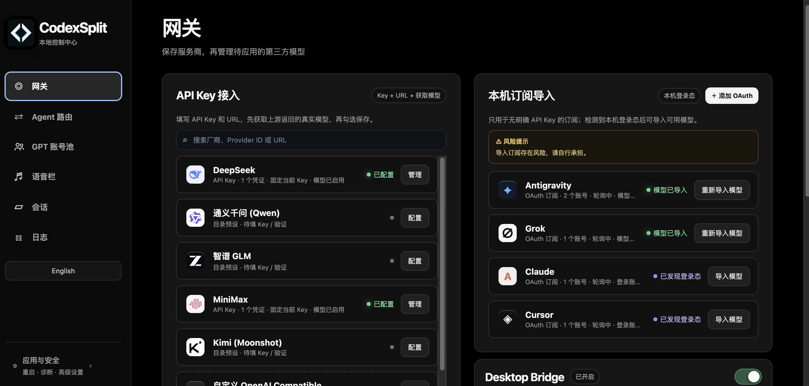
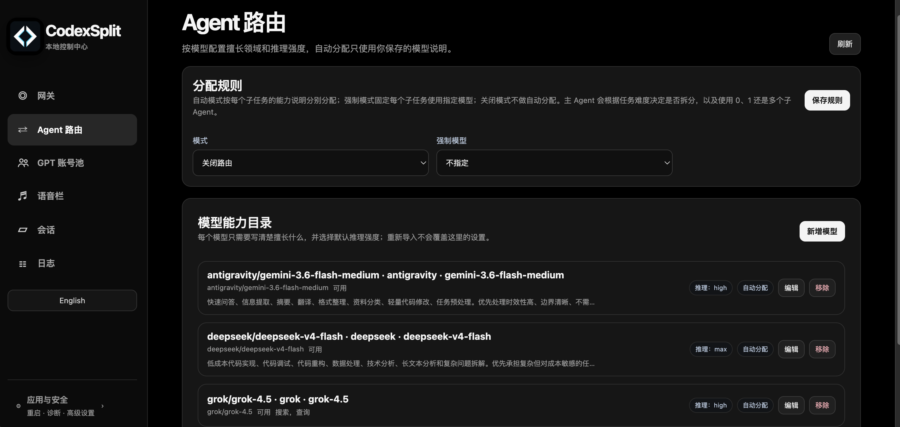
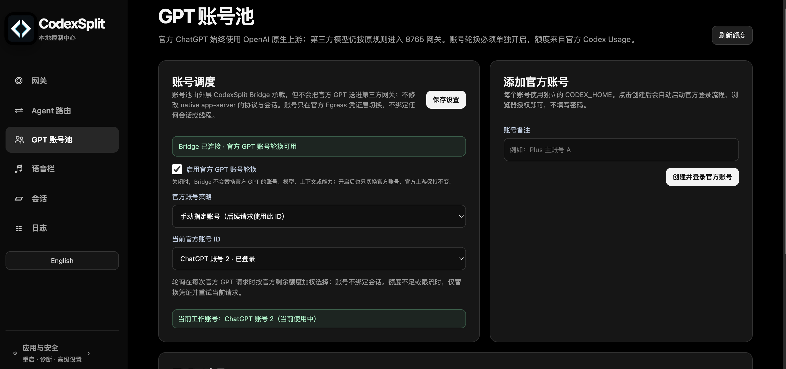
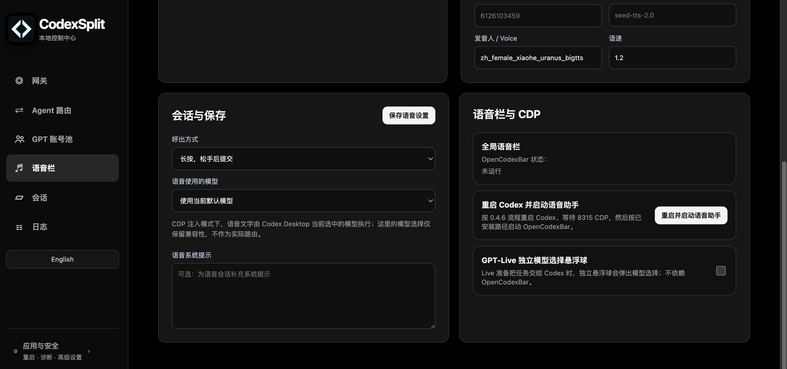
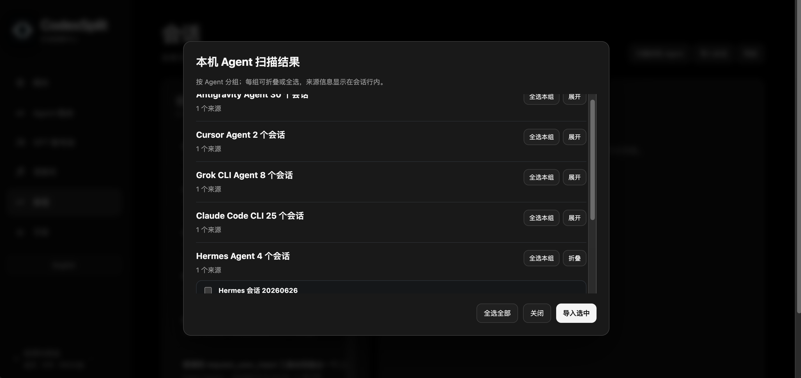

# CodexSplit

### 把 Codex Desktop 变成你的本地 AI 工作台

CodexSplit 是运行在本机的 Codex Desktop 控制中心：管理第三方模型、模型能力、官方 GPT 账号池、GPT-Live、语音栏、子智能体路由和本地会话，同时保留 Codex 原生模型、原生登录、Computer Use 与 MCP 的独立运行方式。

> **项目更名**：CodexSplit 是原 OpenCodex 项目的延续与正式更名版本。产品、源码发布和 GitHub 仓库统一使用 CodexSplit；历史提交、旧版 tag、部分内部目录和兼容标识中仍可能出现 OpenCodex，这些只是历史或兼容信息。

  
  
  
  
  

  <a href="#简体中文">简体中文</a> · <a href="#english">English</a>

  <a href="https://github.com/AITabby/codexsplit/releases/download/v2.0.1/CodexSplit-2.0.1-arm64.dmg">⬇️ 下载 CodexSplit v2.0.1（macOS Apple Silicon）</a>
  ·
  <a href="https://github.com/AITabby/codexsplit/releases/tag/v2.0.1">查看 v2.0.1 Release</a>
  ·
  <a href="https://github.com/AITabby/codexsplit/releases/tag/v1.2.0">🪟 下载 Windows v1.2.0 EXE</a>

## 产品截图

以下截图按实际操作顺序排列：先配置网关，再配置子智能体路由和账号池，最后处理语音与外部 Agent 会话。

### 1. 网关：API Key、OAuth 和 Desktop Bridge

  

### 2. Agent 路由：分配规则和模型能力目录

  

### 3. GPT 账号池：固定账号或额度加权轮询

  

### 4. 语音栏：会话、TTS 和 GPT-Live 浮球

  

### 5. 会话：扫描并导入本机 Agent

  

> 当前发布：macOS Apple Silicon <code>v2.0.1</code> DMG 与源码；Windows 提供 <code>v1.2.0</code> EXE，不提供 Windows 源码；Linux 暂未发布。
>
> macOS DMG 已内置独立 Node.js 和语音运行时，普通用户不需要另装 Node.js、npm、Homebrew 或 .NET SDK。DMG 尚未经过 Apple Developer 签名与公证，首次打开如果被 macOS 拦截，请在“系统设置 → 隐私与安全性”中允许打开。

## 简体中文

### 先理解四条链路

这四条链路互相独立，排查问题时不要把“网关”“Desktop Bridge”“官方账号池”当成同一个东西。

| 场景 | 实际路径 | 说明 |
| --- | --- | --- |
| 官方 GPT 普通主会话 | Codex 原生 OpenAI provider / Native Egress | 不经过第三方 Provider 适配器；主会话、线程、工具和历史仍由 Codex 原生 app-server 管理 |
| GPT-Live 对话本身 | Codex 原生 Live / Realtime | Live 交流始终是 Live；账号跟随已配置的官方 GPT 账号池 |
| 第三方模型主会话 | CodexSplit 本地网关，默认 <code>127.0.0.1:8765</code> | 只有用户添加、导入并应用的第三方模型走这里 |
| <code>spawn_agent</code> / 派任务 | 按 Agent 路由选择模型 | 主会话仍保持原路径；明确产生的子任务才按 Profile 进入第三方网关或其他已配置模型 |

官方路径经过本机 Native Egress 时仍可能经过本地进程，但它不是第三方 <code>8765</code> Provider 路由。GPT-Live 的父对话也不会因为网关开启就变成第三方模型；只有 Live 明确把工作交给子智能体时，子任务才使用 Agent 路由。

### 网关、Desktop Bridge 和 CodexSplit App 的区别

- **网关**：负责 Provider、API Key、模型目录、协议适配和第三方请求，独立启动时默认监听 <code>127.0.0.1:8765</code>。
- **Desktop Bridge**：Codex Desktop 的进程级运行模式开关。开启后，Desktop 才能看到并使用待应用的第三方模型；切换开关会重启 Desktop。
- **CodexSplit App**：控制中心和网关管理界面。打开 App 不等于重启 Codex；首次启动或普通打开 App 不应偷偷接管 Desktop。
- **GPT 账号池**：只管理官方 ChatGPT/Codex 登录账号，不是第三方 API Key 池。

DMG 会管理自己的本地控制服务；从源码启动时，<code>npm start</code> 默认使用 <code>8765</code>。如果只想测试原生 GPT，可以关闭独立的 <code>8765</code> 网关；第三方模型会不可用，但官方原生路径不应因此改走第三方网关。

## 安装和第一次使用

### macOS 普通用户

1. 安装并登录 Codex Desktop。
2. 下载 [CodexSplit v2.0.1 DMG](https://github.com/AITabby/codexsplit/releases/download/v2.0.1/CodexSplit-2.0.1-arm64.dmg)，把 <code>CodexSplit.app</code> 拖入 <code>Applications</code>。
3. 打开 CodexSplit，进入“网关”。
4. 配置一个 API Key Provider，或在“本机订阅导入”中导入已登录的 OAuth 订阅。
5. 保存模型后，先在“待应用模型”中测试。
6. 测试通过后，点击 **“重启 Codex（应用模型菜单）”**，让模型出现在 Codex Desktop 的模型菜单中。

只使用官方 GPT 时不需要添加第三方模型，也不需要为了打开 CodexSplit 手动重启 Codex。第三方模型配置、Desktop Bridge 和 Codex Desktop 的重启是三个明确动作。

### Windows

Windows 用户直接从 [v1.2.0 Release](https://github.com/AITabby/codexsplit/releases/tag/v1.2.0) 下载并运行 Windows EXE，不需要获取或构建源码。Windows EXE 的功能以发布包实际提供的内容为准。

## 网关操作

### 1. 添加 API Key Provider

在“网关 → API Key 接入”中：

1. 选择 DeepSeek、MiniMax、Qwen、Z.ai、Kimi、OpenCode Go 等预设。
2. 预设 Provider 通常只需要填写 API Key；自定义 OpenAI Compatible Provider 还需要填写 Endpoint / Base URL。
3. 点击“获取可用模型”，以当前 Endpoint 实际返回的模型为准。
4. 选择模型，并按上游能力选择 <code>Chat</code> 或 <code>Responses</code> 协议。
5. 点击保存。模型会先进入“待应用模型”，不会自动重启 Codex。
6. 逐个测试模型；测试失败时先看 Endpoint、Key、模型 ID 和协议是否匹配。
7. 需要让 Desktop 使用它时，再点击“重启 Codex（应用模型菜单）”。

Provider 名称和模型会生成稳定命名空间，例如 <code>deepseek/model-name</code>、<code>opencode/model-name</code>，不同 Provider 的同名模型不会互相覆盖。预设只提供公开的 Endpoint 和模型元数据，不代表服务商官方合作、权限或可用性；最终以你自己的 Key 和测试结果为准。

特别感谢 [CC Switch](https://github.com/farion1231/cc-switch) 项目及贡献者：CodexSplit 的第三方 Provider 预设厂商目录直接使用了其公开的 [Codex Provider presets](https://github.com/farion1231/cc-switch/blob/main/src/config/codexProviderPresets.ts)，包括厂商名称、公开 Endpoint 元数据、协议提示和模型 ID。感谢 CC Switch 对这些第三方 Provider 信息的整理；实际接口权限和可用性仍以用户自己的服务商和 API Key 为准。

### 2. 一个 Provider 配多个 API Key

打开某个 Provider 的“管理”后，可以在 **API Key 凭证池**中添加多个 Key：

- **固定当前 Key**：始终使用下拉框中选中的 Key。
- **顺序轮询**：按顺序切换可用 Key。
- **失败自动切换**：当前 Key 返回失效或失败时跳过并尝试其他 Key。

Key 只属于这个 Provider，密钥保存在 macOS Keychain；前端只显示掩码和状态。401/403 会标记为失效，429 会暂时冷却，调度时会跳过不可用凭证。移除按钮只移除当前 Provider 的这一条 API Key，不会删除官方 GPT 账号、OAuth 订阅或其他 Provider。

这里的 API Key 凭证池与下面的“GPT 账号池”完全不是一回事：

- 第三方模型使用服务商 API Key。
- 官方 GPT 使用官方登录账号和官方 Codex Usage。
- Antigravity、Grok、Claude、Cursor 等本机订阅使用各自的 OAuth 登录态。

### 3. 导入本机订阅

在“网关 → 本机订阅导入”中：

1. 点击 **“＋ 添加 OAuth”**，选择 Provider。
2. 按提示完成官方客户端登录，或捕获当前登录态。
3. 看到“已发现登录态”后，仍要点击 **“导入模型”**；检测到登录文件不等于模型已经加入 Desktop。
4. 导入模型后，回到“待应用模型”测试并按需重启 Codex。
5. 支持多个账号的订阅可以进入 OAuth 账号池，选择固定或轮询策略。

订阅导入按实时返回的模型目录工作，不会只凭硬编码列表声称模型可用。

### 4. Desktop Bridge 开关

在网关页的 Desktop Bridge 卡片中：

- **开启**：保存的第三方模型对 Desktop 暴露，并重启 Desktop 进入 Bridge 模式。
- **关闭**：重启 Desktop，恢复官方原生模型菜单；Provider、API Key、订阅和模型配置保留。
- **普通打开 CodexSplit**：不应因为 App 启动就重启 Codex。
- **普通重启网关**：不等于切换 Bridge，也不应删除已保存配置。
- **“重启 Codex（应用模型菜单）”**：是应用待应用模型和重新加载 Desktop 模型菜单的显式动作。

网关停止后，第三方请求没有 <code>8765</code> 可达；官方 GPT 和官方 GPT-Live 仍由原生路径负责。若 Bridge 已经开启，停止网关不会把已保存的 Bridge 状态改成关闭；要恢复原生模式，使用 Desktop Bridge 开关关闭或使用“恢复原生 Codex”。

### 5. 筛选 Codex 官方模型

在“应用与安全 → Codex 官方模型筛选”中，可以只勾选希望出现在 Desktop 模型选择器中的官方模型。该设置只修改官方 Codex 模型的显示状态，不会隐藏、删除或改写 DeepSeek、Grok、Kimi 等第三方 Provider 模型；关闭筛选会恢复官方模型原有的可见性。

### 6. 独立启动、停止和检查 <code>8765</code>

从源码运行：

~~~bash
git clone https://github.com/AITabby/codexsplit.git
cd codexsplit
npm install
npm run build
npm start
~~~

默认管理页：

~~~text
http://127.0.0.1:8765/dashboard
~~~

使用 PM2 时，先确认进程是否存在：

~~~bash
pm2 ls
pm2 start dist/server.js --name opencodex --no-treekill
pm2 restart opencodex --update-env
pm2 stop opencodex
~~~

如果 <code>pm2 restart opencodex</code> 报 <code>Process or Namespace opencodex not found</code>，说明这个 PM2 进程还没有创建，应先执行 <code>pm2 start</code>，不是继续执行 <code>restart</code>。检查 <code>8765</code> 是否监听：

~~~bash
lsof -nP -iTCP:8765 -sTCP:LISTEN
~~~

要测试“关闭网关”的隔离效果，停止的是 <code>opencodex</code>/<code>8765</code> 服务，不要同时关闭 Codex Desktop。此时第三方模型应失败或不可见，官方原生 GPT 不应被改写成第三方路径。

## GPT 官方账号池

### 添加账号

进入“GPT 账号池”：

1. 在“添加官方账号”中填写备注。
2. 点击 **“创建并登录官方账号”**。
3. 在浏览器完成官方登录授权；不填写密码，也不在 CodexSplit 中复制 Token。
4. 回到账号池，确认账号状态和官方额度已经同步。

每个官方账号使用独立的 <code>CODEX_HOME</code>。账号池显示的是官方账号状态和官方 Codex Usage，不是第三方 API Key。

### 选择账号策略

在“账号调度”中：

- 勾选 **“启用官方 GPT 账号轮换”**，再保存设置。
- **手动指定账号**：选择“当前官方账号 ID”，后续官方请求固定使用这个账号。
- **额度余量加权轮询**：每次官方请求按官方剩余额度加权重新选择可用账号；它不是简单随机，也不把账号绑定到某个会话。

如果你明确要用账号 2，必须选择 **“手动指定账号”** 并把当前账号 ID 选为账号 2；仅仅在列表里看到账号 2，或者保持轮询策略，都不能保证下一次请求仍是账号 2。

账号不足、失效或触发限流时，账号池可以替换官方凭证并重试当前请求；不会把官方 GPT 的模型、上下文或工具改成第三方 Provider。

### GPT-Live 与账号池

GPT-Live 的父对话跟随官方账号池。Live 开始后，当前 Live 会话会绑定已选择的官方账号，普通的 Live 交流仍使用原生 Live / Realtime。

只有在 Live 中明确把任务交给 Codex 或子智能体时，那个子任务才按“Agent 路由”选择模型；不要把 Live 对话本身和第三方子任务混为一条链路。

## Agent 路由和子智能体

### 1. 先准备可用模型

子智能体只能使用已经被网关发现、保存、测试，并且在当前 Desktop 模式中可用的模型。先完成：

1. 网关添加 Provider 或导入订阅。
2. 保存模型。
3. 测试模型。
4. 按需重启 Codex / 开启 Desktop Bridge。

### 2. 配置模型能力目录

进入“Agent 路由 → 模型能力目录”：

1. 点击 **“新增模型”**。
2. 选择一个已接入模型。
3. 在“擅长领域 / 工作说明”中写清楚它适合做什么，例如“代码实现、调试、重构、技术分析”。
4. 选择该模型实际支持的默认推理强度。
5. 勾选或取消 **“参与自动分配”**。
6. 点击 **“保存模型配置”**。

这份配置是用户的 Agent Profile，不属于模型导入目录；重新获取模型或重新导入订阅不会覆盖工作说明和路由配置。

### 3. 选择分配规则

在“分配规则”中选择：

- **自动分配**：根据每个子任务的能力说明选择模型。
- **强制选择**：所有子任务固定使用下拉框中的模型。
- **关闭路由**：不做自动子任务分配，使用原始默认行为。

保存规则后，主 Agent 会根据任务难度决定是否拆分，以及创建 0、1 个还是多个子 Agent。关闭路由并不等于删除模型，只是不自动替子任务选模型。

### 4. 实际触发子智能体

配置完成后，在 Codex 主会话中直接提出需要拆分的工作，例如：

> “请先让一个模型检查项目结构，再让另一个模型实现修改并运行测试。”

主 Agent 会在需要时调用 <code>spawn_agent</code> / “派任务”。此时：

- 父会话继续使用它自己的原生路径。
- 子任务带着明确的子会话边界进入 Agent 路由。
- 选中的第三方子任务通过 <code>127.0.0.1:8765/v1/responses</code> 执行。
- 子任务完成后，结果返回父会话继续工作。
- 如果主 Agent 判断不需要拆分，也可能不创建子智能体，这是正常的。

GPT-Live 的语音父会话同样保持原生 Live；Live 只有在明确派任务时才创建使用 Agent Profile 的子任务。第三方模型作为父模型时，网关可以代为执行它发出的 <code>spawn_agent</code> 子任务，但父模型和子模型仍按各自路由处理。

## GPT-Live、语音栏和 Computer Use

### GPT-Live

- 从 Codex 原生 Live 入口主动开始，不会因为打开 CodexSplit 或网关而自动启动。
- Live 的交流模型就是原生 Live；账号跟随官方 GPT 账号池。
- 如需让任务使用第三方模型，在 Agent 路由中配置模型能力，再在 Live 中明确派任务。
- Live 的停止动作只应结束当前 Live 请求，不应取消其他普通会话或其他子任务。

### 语音栏

“语音栏”中可以配置：

- STT：本地 Whisper，或 OpenAI Compatible / Groq 转写接口。
- TTS：Edge TTS、火山/豆包、MiniMax、MiMo 或 OpenAI Compatible TTS。
- 会话提交方式、VAD 静音阈值、结束等待时间、语音模型和语音系统提示。
- GPT-Live 独立模型选择浮球和 Voice Bar HUD。

语音栏的模型选择只影响语音助手相关功能，不会把官方 GPT 主会话或普通 Codex 会话自动改成第三方模型。

### Computer Use 与 MCP

第三方模型请求桌面操作时，桌面动作仍由 Codex 原生执行器完成；截图、鼠标、键盘、工具结果和后续多轮调用由网关做协议适配。CodexSplit 不会替换官方 MCP 配置。需要回到完全原生的 Desktop 模式时，使用“恢复原生 Codex”。

## 会话中心

进入“会话”后：

1. 左侧加载本地会话列表。
2. 点击会话查看完整可见消息、模型、工作目录和时间。
3. 点击详情右上角 **“删除”**，删除对应的本地 rollout、历史索引和会话记录。
4. 如果删除后列表仍显示旧项目，点击“刷新”；列表刷新失败不会把已经删除的文件恢复。
5. 点击“导入会话”可以导入 JSON、JSONL、SQLite、DB 或 Markdown 文件。
6. 点击“扫描本机 Agent”，按 Agent 分组展开，勾选会话后点击“导入选中”。

扫描支持 Antigravity、Cursor Agent、Grok CLI、Claude Code CLI 和 Hermes Agent。导入后会注册到 Codex 会话库；必要时 Codex 会重启以刷新 Desktop 侧边栏。

会话删除只作用于会话文件和索引，不会删除 Provider、API Key、OAuth 订阅或 GPT 官方账号。

## 应用、安全和还原

- 网关默认只监听 <code>127.0.0.1</code>，不直接暴露到局域网。
- Provider API Key 在 macOS 上保存到 Keychain，页面只显示掩码和状态。
- 配置文件保存 Provider、模型和凭证引用等非敏感元数据，不把完整 Key 返回给前端。
- “恢复原生 Codex”会停止 Desktop Bridge、恢复官方模型目录并重新启动官方 Desktop；已保存的 Provider、Key、订阅和 Agent Profile 不会因此删除。
- 网关带单实例锁和退出清理，避免重复占用同一个本地端口。

## 常见问题

### 官方 GPT 能聊，第三方模型不能聊

先确认三件事：第三方模型已测试通过、Desktop Bridge 已开启、<code>127.0.0.1:8765</code> 正在监听。官方 GPT 正常只能证明原生链路正常，不能证明第三方 Provider 或网关正常。

### <code>pm2 restart opencodex</code> 找不到进程

这是 PM2 进程名不存在，不是 API Key 错误。先执行：

~~~bash
pm2 start dist/server.js --name opencodex --no-treekill
~~~

之后才使用：

~~~bash
pm2 restart opencodex --update-env
~~~

### 模型保存了，但 Codex 菜单没有

模型保存后只会进入“待应用模型”。先测试，再点击“重启 Codex（应用模型菜单）”；单纯刷新网页不会把模型写入 Desktop 菜单。

### 页面显示 Key 不存在

这表示当前 Provider 的某条 API Key 在 macOS Keychain 中找不到。重新填写同一个 Provider 的 Key 并保存即可覆盖/补回正确凭证；它不是 GPT 官方账号，也不是 macOS 中所有 Keychain 记录的总数。

### 想关闭 <code>8765</code> 做隔离测试

只停止网关进程：

~~~bash
pm2 stop opencodex
~~~

保持 Codex Desktop 打开，再分别测试官方 GPT 和第三方模型。第三方模型不可用是预期结果；官方原生 GPT 不应因此被送入第三方网关。

## 从源码运行和测试

需要 Node.js 和 npm：

~~~bash
git clone https://github.com/AITabby/codexsplit.git
cd codexsplit
npm install
npm run build
npm start
~~~

运行测试：

~~~bash
npm test
~~~

构建 macOS 桌面应用和 DMG：

~~~bash
npm run build:all
./macos-app/scripts/package-dmg.sh
~~~

DMG 产物位于：

~~~text
macos-app/build/CodexSplit-<version>-arm64.dmg
~~~

## 工作方式

~~~text
Codex Desktop
  ├─ 官方 GPT 主会话 / 原生 Responses
  ├─ 原生 Computer Use / MCP
  └─ 原生 GPT-Live / Realtime
          │
          │ 只有明确的 spawn_agent / Live 派任务才跨越子任务边界
          ▼
CodexSplit
  ├─ Provider、API Key、OAuth 和模型目录
  ├─ 127.0.0.1:8765 第三方模型网关
  ├─ Agent Profile 与子智能体路由
  ├─ GPT 官方账号池与额度调度
  ├─ 语音 STT / TTS / Voice Bar
  └─ 会话浏览、扫描、导入和本地诊断
          │
          ▼
第三方 API 服务商 / 本机订阅 / OpenAI Compatible 服务
~~~

## 项目链接

- [GitHub Repository](https://github.com/AITabby/codexsplit)
- [GitHub Issues](https://github.com/AITabby/codexsplit/issues)
- [Latest Release](https://github.com/AITabby/codexsplit/releases/latest)
- [下载 CodexSplit v2.0.1 macOS DMG](https://github.com/AITabby/codexsplit/releases/download/v2.0.1/CodexSplit-2.0.1-arm64.dmg)
- [下载 CodexSplit v1.2.0 Windows EXE](https://github.com/AITabby/codexsplit/releases/tag/v1.2.0)
- [Voice Assistant Guide](./VOICE_GUIDE.md)
- [Test Flow](./TEST_FLOW.md)
- [X / Twitter: @youngxxxxu](https://x.com/youngxxxxu)

---

## English

### What CodexSplit is

CodexSplit is a local control center for Codex Desktop. It manages third-party providers, model metadata, the official GPT account pool, GPT-Live handoffs, voice settings, Agent routing, and local session import while keeping native Codex behavior available.

### Four routing boundaries

| Scenario | Path | Meaning |
| --- | --- | --- |
| Official GPT main conversation | Native OpenAI provider / Native Egress | Native Codex app-server owns the thread, history, tools, and lifecycle; it does not use a third-party Provider adapter |
| GPT-Live conversation | Native Live / Realtime | The Live conversation remains Live and follows the selected official GPT account-pool policy |
| Third-party main model | CodexSplit local gateway, normally <code>127.0.0.1:8765</code> | Only models explicitly added, imported, tested, and applied by the user use this route |
| <code>spawn_agent</code> / task handoff | Agent Routing and the selected Profile | The parent keeps its own path; only the explicit child task is routed to the selected model |

Official traffic may still cross a local Native Egress process, but that is not the third-party Provider route on <code>8765</code>. Opening the gateway does not turn the GPT-Live parent conversation into a third-party model; only an explicit Live task handoff crosses the child-task boundary.

### Gateway, Desktop Bridge, and the CodexSplit app

- **Gateway**: manages Providers, API Keys, model discovery, protocol adapters, and third-party requests. A source checkout listens on <code>127.0.0.1:8765</code> by default.
- **Desktop Bridge**: a process-level Codex Desktop mode switch. Enabling or disabling it restarts Desktop so the model menu is rebuilt safely.
- **CodexSplit app**: the local control center and gateway UI. Opening the app does not mean restarting Codex Desktop.
- **GPT Account Pool**: manages official ChatGPT/Codex login accounts, not third-party API Keys.

The DMG manages its own local control service. A source checkout uses <code>npm start</code> and the default port <code>8765</code>. If you stop the standalone <code>8765</code> gateway for isolation testing, third-party models should stop working while native official GPT remains on its native path.

## Installation and first use

### macOS

1. Install and sign in to Codex Desktop.
2. Download [CodexSplit v2.0.1 for Apple Silicon](https://github.com/AITabby/codexsplit/releases/download/v2.0.1/CodexSplit-2.0.1-arm64.dmg) and drag <code>CodexSplit.app</code> into <code>Applications</code>.
3. Open CodexSplit and enter **Gateway**.
4. Configure an API Key Provider or import a local OAuth subscription.
5. Save a model and test it under **Pending Models**.
6. After the test succeeds, click **Restart Codex (apply model menu)** so the model appears in Codex Desktop.

If you only use official GPT, you do not need to add a third-party model or manually restart Codex just to open CodexSplit. Third-party model configuration, Desktop Bridge switching, and Codex Desktop restart are explicit actions.

### Windows

Windows users download and run the Windows EXE from the [v1.2.0 Release](https://github.com/AITabby/codexsplit/releases/tag/v1.2.0). Windows source is not distributed; do not clone or build the repository for the Windows installation workflow. The Windows EXE provides the features included in that release package.

### macOS DMG notes

The macOS DMG includes its own Node.js and voice runtime. End users do not need to install Node.js, npm, Homebrew, or the .NET SDK. The DMG is not notarized; if macOS blocks the first launch, allow it under **System Settings → Privacy & Security**.

## Gateway operations

### 1. Add an API Key Provider

Open **Gateway → API Key Access**:

1. Choose a preset such as DeepSeek, MiniMax, Qwen, Z.ai, Kimi, or OpenCode Go.
2. Presets normally need only an API Key. A custom OpenAI-compatible Provider also needs an Endpoint / Base URL.
3. Click **Get Available Models**. The returned model list from the current Endpoint is the source of truth.
4. Choose a model and select <code>Chat</code> or <code>Responses</code> according to the upstream API.
5. Save. The model first appears under **Pending Models** and does not automatically restart Codex.
6. Test the model individually. On failure, check the Endpoint, Key, backend model ID, and protocol.
7. When you want Desktop to use it, click **Restart Codex (apply model menu)**.

Provider and model names receive stable namespaces such as <code>deepseek/model-name</code> and <code>opencode/model-name</code>, so same-named models from different Providers do not overwrite each other. Presets provide public endpoint and model metadata; they are not an official partnership or a guarantee of access, billing, or compatibility.

### 2. Configure multiple API Keys for one Provider

Open a Provider's **Manage** view and use the **API Key Credential Pool**:

- **Fixed current Key**: always use the selected Key.
- **Round robin**: rotate through available Keys in order.
- **Failover**: skip a failed or invalid Key and try another one.

Keys belong only to that Provider and are stored in the macOS Keychain. The dashboard shows masked values and status. HTTP 401/403 marks a credential invalid; HTTP 429 temporarily cools it down; scheduling skips unavailable credentials. Removing a credential removes only that Provider Key. It does not remove official GPT accounts, OAuth subscriptions, or other Providers.

These are separate credential systems:

- Third-party models use Provider API Keys.
- Official GPT uses official login accounts and official Codex Usage.
- Antigravity, Grok, Claude, and Cursor local subscriptions use their own OAuth login states.

### 3. Import a local subscription

Under **Gateway → Local Subscription Import**:

1. Click **＋ Add OAuth** and choose a Provider.
2. Complete the login flow or capture the current client login state.
3. After a login state is detected, still click **Import Models**. Detecting a login file does not add models by itself.
4. Test the imported model under **Pending Models**, then restart Codex if needed.
5. Providers that support multiple subscription accounts can use their OAuth account pool with fixed or round-robin selection.

Subscription imports use live model discovery instead of claiming that a hardcoded model list is available.

### 4. Use the Desktop Bridge switch

On the Desktop Bridge card:

- **Enable**: expose saved third-party models to Desktop and restart Desktop into Bridge mode.
- **Disable**: restart Desktop and restore the official native model menu. Provider, API Key, subscription, and model configuration remain saved.
- **Open CodexSplit normally**: must not restart Codex just because the app opened.
- **Restart the gateway normally**: is not the same as switching Bridge and must not delete saved configuration.
- **Restart Codex (apply model menu)**: explicitly applies pending models and reloads the Desktop model menu.

When the gateway is stopped, third-party requests have no reachable <code>8765</code> route. Official GPT and official GPT-Live remain owned by their native paths. Stopping the gateway does not itself erase the saved Bridge preference; use the Bridge switch or **Restore Native Codex** when you want native Desktop mode.

### 5. Filter official Codex models

Under **App & Security → Official Codex Model Filter**, select which official models should appear in the Desktop picker. This setting only changes official Codex model visibility; it never hides, deletes, or rewrites third-party Provider models such as DeepSeek, Grok, or Kimi. Disabling the filter restores the official models' original visibility.

### 6. Start, stop, and inspect <code>8765</code>

Run from source:

~~~bash
git clone https://github.com/AITabby/codexsplit.git
cd codexsplit
npm install
npm run build
npm start
~~~

Open:

~~~text
http://127.0.0.1:8765/dashboard
~~~

With PM2, check whether the process exists before restarting it:

~~~bash
pm2 ls
pm2 start dist/server.js --name opencodex --no-treekill
pm2 restart opencodex --update-env
pm2 stop opencodex
~~~

If <code>pm2 restart opencodex</code> says <code>Process or Namespace opencodex not found</code>, the PM2 process has not been created yet. Run <code>pm2 start</code> first. Check the listener with:

~~~bash
lsof -nP -iTCP:8765 -sTCP:LISTEN
~~~

For a gateway-isolation test, stop only <code>opencodex</code>/<code>8765</code> and leave Codex Desktop open. Third-party models should become unavailable; native official GPT should not be redirected to the third-party gateway.

## Official GPT account pool

### Add an account

Open **GPT Account Pool**:

1. Enter an optional label under **Add Official Account**.
2. Click **Create and Login Official Account**.
3. Complete the official browser authorization. Do not enter a password into CodexSplit or copy a Token into the app.
4. Return to the account pool and confirm the account status and official quota.

Each official account uses an independent <code>CODEX_HOME</code>. The pool displays official account state and official Codex Usage, not third-party API Keys.

### Choose the account policy

Under **Account Scheduling**:

- Enable **Official GPT account rotation**, then save.
- **Manually specified account**: choose the Current Official Account ID; subsequent official requests use that ID.
- **Quota-weighted round robin**: select an available account for each official request using official remaining quota. This is not simple random rotation and does not bind an account to a conversation.

If you specifically want Account 2, select **Manually specified account** and choose Account 2 as the current ID. Merely seeing Account 2 in the list, or leaving round robin enabled, does not guarantee that the next request uses Account 2.

If an account is unavailable, expired, or rate-limited, the pool can replace the official credential and retry the current request. It does not change the official GPT model, context, or tools into a third-party Provider.

### GPT-Live and the account pool

The GPT-Live parent conversation follows the official GPT account-pool policy. Once Live starts, the current Live session binds to the selected official account; ordinary Live communication remains native Live / Realtime.

Only when Live explicitly hands work to Codex or a subagent does that child task use Agent Routing. Do not treat the Live conversation and a third-party child task as one request path.

## Agent Routing and subagents

### 1. Prepare an available model

A subagent can use only a model that has been discovered, saved, tested, and made available in the current Desktop mode:

1. Add a Provider or import a subscription under Gateway.
2. Save the model.
3. Test the model.
4. Restart Codex or enable Desktop Bridge as needed.

### 2. Configure the model capability directory

Open **Agent Routing → Model Capability Directory**:

1. Click **Add Model**.
2. Select an imported and available model.
3. Write a clear **Areas of expertise / Work description**, such as “code implementation, debugging, refactoring, and technical analysis.”
4. Select a default reasoning level supported by that model.
5. Enable or disable **Participate in automatic assignment**.
6. Click **Save Model Configuration**.

This is a persistent user Agent Profile, separate from the imported model catalog. Refreshing models or re-importing a subscription does not overwrite the saved work description or routing policy.

### 3. Choose the assignment rule

Under **Assignment Rules**, choose:

- **Automatic assignment**: select a model from the capability description for each child task.
- **Forced selection**: send every child task to the selected model.
- **Routing off**: do not automatically assign a model; preserve the original default behavior.

After saving, the main Agent decides whether the task needs zero, one, or multiple subagents. Turning routing off does not delete a model; it only disables automatic child-task model assignment.

### 4. Trigger a subagent in practice

After configuration, ask the main Codex conversation for work that can be split, for example:

> “First have one model inspect the project structure, then have another implement the change and run the tests.”

When appropriate, the main Agent calls <code>spawn_agent</code> / **Delegate Task**:

- The parent conversation keeps its own native path.
- The explicit child task enters Agent Routing with a separate child boundary.
- A selected third-party child runs through <code>127.0.0.1:8765/v1/responses</code>.
- The completed result returns to the parent conversation.
- If the main Agent decides that splitting is unnecessary, no subagent may be created; that is expected.

The GPT-Live voice parent remains native in the same way. Only an explicit Live handoff creates a child task using an Agent Profile. If a third-party parent model emits <code>spawn_agent</code>, the gateway can execute that child locally while keeping the parent and child routes separate.

## GPT-Live, Voice Bar, and Computer Use

### GPT-Live

- Start it deliberately from the native Codex Live entry; opening CodexSplit or the gateway does not start Live.
- The conversation model is native Live, and the account follows the official GPT account pool.
- To make work run on a third-party model, configure Agent Routing and explicitly delegate the task from Live.
- Stopping Live should stop the current Live request, not cancel unrelated conversations or child tasks.

### Voice Bar

The Voice Bar view configures:

- STT: local Whisper, or an OpenAI-compatible / Groq transcription API.
- TTS: Edge TTS, Volcengine/Doubao, MiniMax, MiMo, or an OpenAI-compatible TTS API.
- Submit behavior, VAD silence threshold, end-of-speech delay, voice model, and voice system prompt.
- The independent GPT-Live model picker and the Voice Bar HUD.

Voice model selection affects voice-assistant behavior. It does not automatically change the official GPT main conversation or an ordinary Codex conversation into a third-party model.

### Computer Use and MCP

When a third-party model requests desktop actions, the actual desktop action is still performed by the Codex-native executor. CodexSplit adapts screenshots, mouse, keyboard, tool results, and multi-turn continuations at the protocol boundary. It does not replace the official MCP configuration. Use **Restore Native Codex** to return Desktop to the native mode.

## Sessions

In **Sessions**:

1. Load the local session list.
2. Select a session to view visible messages, model, working directory, and time.
3. Click **Delete** in the detail header to remove the local rollout, history index, and session record.
4. If a deleted item remains visible because of a stale list, click **Refresh**. A failed refresh does not restore a file that was already deleted.
5. Use **Import Session** for JSON, JSONL, SQLite, DB, or Markdown files.
6. Use **Scan Local Agents**, expand an Agent group, select sessions, and click **Import Selected**.

Scanning supports Antigravity, Cursor Agent, Grok CLI, Claude Code CLI, and Hermes Agent. Imported sessions are registered in the Codex session database; Codex may restart to refresh the Desktop sidebar.

Session deletion affects session files and indexes only. It does not delete Providers, API Keys, OAuth subscriptions, or official GPT accounts.

## Security and recovery

- The gateway listens on <code>127.0.0.1</code> by default and is not exposed directly to the LAN.
- macOS Provider API Keys are stored in Keychain; the UI displays only masked values and status.
- Configuration stores Provider, model, and credential references as non-sensitive metadata and does not return full Keys to the frontend.
- **Restore Native Codex** stops Desktop Bridge, restores the official model catalog, and relaunches official Desktop without deleting saved Providers, Keys, subscriptions, or Agent Profiles.
- A single-instance lock and parent-process cleanup reduce duplicate local gateway processes.

## Frequently asked questions

### Official GPT works, but a third-party model does not

Check that the third-party model was tested successfully, Desktop Bridge is enabled, and <code>127.0.0.1:8765</code> is listening. A working official GPT path proves only the native path; it does not prove the third-party Provider or gateway.

### PM2 cannot find <code>opencodex</code>

That means the PM2 process name does not exist; it is not an API Key error. Run:

~~~bash
pm2 start dist/server.js --name opencodex --no-treekill
~~~

Then use:

~~~bash
pm2 restart opencodex --update-env
~~~

### The model is saved but missing from the Codex menu

Saving puts the model into **Pending Models** only. Test it first, then click **Restart Codex (apply model menu)**. Refreshing the webpage alone does not write the model into Desktop.

### The dashboard says a Key does not exist

The current Provider credential is missing from the macOS Keychain. Re-enter and save the Key for that same Provider to restore the credential. This is not an official GPT account and is not the total number of Keychain records on the Mac.

### I want to stop <code>8765</code> for an isolation test

Stop only the gateway process:

~~~bash
pm2 stop opencodex
~~~

Keep Codex Desktop open and test official GPT and third-party models separately. Third-party failure is expected; native official GPT should not be sent to the third-party gateway.

## Source development and tests

The source workflow requires Node.js and npm:

~~~bash
git clone https://github.com/AITabby/codexsplit.git
cd codexsplit
npm install
npm run build
npm start
~~~

Open <code>http://127.0.0.1:8765/dashboard</code>.

Run tests:

~~~bash
npm test
~~~

Build the macOS desktop application and DMG:

~~~bash
npm run build:all
./macos-app/scripts/package-dmg.sh
~~~

The DMG is written to:

~~~text
macos-app/build/CodexSplit-<version>-arm64.dmg
~~~

## Acknowledgements

Special thanks to the [CC Switch](https://github.com/farion1231/cc-switch) project and its contributors. CodexSplit directly uses the public [Codex Provider presets](https://github.com/farion1231/cc-switch/blob/main/src/config/codexProviderPresets.ts) for its third-party Provider vendor catalog, including provider names, public endpoint metadata, protocol hints, and model IDs. Thank you to CC Switch for organizing this third-party Provider information; actual access and availability still depend on the user's Provider and API Key.

## Working model

~~~text
Codex Desktop
  ├─ Official GPT main conversation / native Responses
  ├─ Native Computer Use / MCP
  └─ Native GPT-Live / Realtime
          │
          │ Only an explicit spawn_agent / Live handoff crosses the child boundary
          ▼
CodexSplit
  ├─ Provider, API Key, OAuth, and model catalog
  ├─ 127.0.0.1:8765 third-party gateway
  ├─ Agent Profiles and subagent routing
  ├─ Official GPT account pool and quota scheduling
  ├─ Voice STT / TTS / Voice Bar
  └─ Session browsing, scanning, import, and local diagnostics
          │
          ▼
Third-party API providers / local subscriptions / OpenAI-compatible services
~~~

## Links

- [Repository](https://github.com/AITabby/codexsplit)
- [Issues](https://github.com/AITabby/codexsplit/issues)
- [Latest release](https://github.com/AITabby/codexsplit/releases/latest)
- [Download CodexSplit v2.0.1 macOS DMG](https://github.com/AITabby/codexsplit/releases/download/v2.0.1/CodexSplit-2.0.1-arm64.dmg)
- [Download CodexSplit v1.2.0 Windows EXE](https://github.com/AITabby/codexsplit/releases/tag/v1.2.0)
- [Voice Assistant Guide](./VOICE_GUIDE.md)
- [Test Flow](./TEST_FLOW.md)
- [X / Twitter: @youngxxxxu](https://x.com/youngxxxxu)
