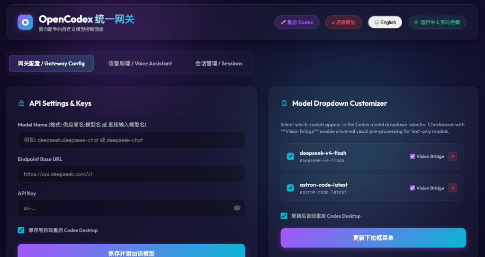
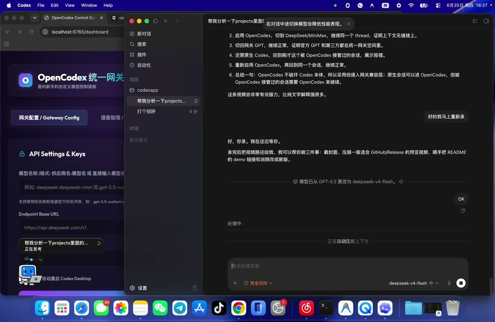

<h1 align="center">OpenCodex</h1>

<p align="center">
  <strong>Use GPT, DeepSeek, MiniMax, OpenRouter, SiliconFlow, and other models inside Codex Desktop through one local gateway.</strong>
</p>

<p align="center">
  <a href="https://github.com/AITabby/opencodex/stargazers"></a>
  <a href="https://github.com/AITabby/opencodex"></a>
  <a href="https://github.com/AITabby/opencodex"></a>
  <a href="https://github.com/AITabby/opencodex"></a>
</p>

[English](#english) | [简体中文](#简体中文)

<p align="center">
  
</p>

<p align="center">
  <a href="https://raw.githubusercontent.com/AITabby/opencodex/master/assets/demo_continuity.mp4"><strong>Watch the demo video</strong></a>
  ·
  <a href="#quick-start"><strong>Quick start</strong></a>
  ·
  <a href="#unified-model-space-and-conversation-continuity"><strong>How conversation continuity works</strong></a>
</p>

<p align="center">
  <a href="https://raw.githubusercontent.com/AITabby/opencodex/master/assets/demo_continuity.mp4">
    
  </a>
</p>

---

# English

**OpenCodex** is a local gateway for Codex Desktop. It lets Codex use both native OpenAI GPT models and third-party OpenAI-compatible models through one controlled local entry point.

If you want Codex Desktop to work with your own API keys, cheaper model providers, local-compatible endpoints, or model routers such as OpenRouter, OpenCodex is the missing bridge.

The important idea is simple:

- Native OpenAI GPT models are passed through to the official backend.
- Third-party models are translated between Codex's Responses API shape and OpenAI-compatible Chat Completions.
- When every model is used through OpenCodex, Codex sees one unified model space, so you can switch between GPT and third-party models inside the same Codex conversation.

OpenCodex is designed to extend Codex without patching or modifying the Codex app binary.

## Why People Use It

- Use third-party models in Codex Desktop without manually editing config files.
- Keep GPT and non-GPT models in one model picker.
- Switch between configured third-party models inside the same Codex conversation.
- Use text-only models with screenshots through Vision Bridge.
- Manage providers, API keys, model aliases, logs, voice settings, and reset actions from a dashboard.
- Keep the Codex app itself untouched.

If OpenCodex helps you, starring the repo helps more people find it.

## Demo

Watch the demo:

[Watch demo video](https://raw.githubusercontent.com/AITabby/opencodex/master/assets/demo_continuity.mp4)

The demo shows the gateway dashboard, model setup, Codex Desktop routing, GPT-to-DeepSeek switching, and the unified model switching experience.

<p align="center">
  <a href="https://raw.githubusercontent.com/AITabby/opencodex/master/assets/demo_continuity.mp4">
    
  </a>
</p>

## At A Glance

| Need | OpenCodex answer |
| --- | --- |
| Use DeepSeek, MiniMax, OpenRouter, SiliconFlow, or other compatible APIs in Codex | Add the provider in the dashboard and expose it as a Codex model |
| Keep official GPT available | Native GPT requests are passed through to the official backend |
| Switch models inside a conversation | OpenCodex keeps a unified gateway model space and local third-party session history |
| Continue an existing native Codex conversation | OpenCodex can usually take over the visible thread context and continue through the gateway |
| Use text-only models for visual tasks | Vision Bridge describes screenshots with a vision model and injects the description |
| Return to native Codex | Use the reset action; OpenCodex conversations may require OpenCodex to continue |

## What OpenCodex Does

OpenCodex starts a local server at:

```text
http://127.0.0.1:8765
```

It automatically adds a managed block to `~/.codex/config.toml` so Codex routes model requests through the local gateway:

```toml
openai_base_url = "http://127.0.0.1:8765/v1"

[model_providers.opencodex]
name = "OpenCodex"
base_url = "http://127.0.0.1:8765/v1"
wire_api = "responses"
```

OpenCodex also maintains a custom model catalog under:

```text
~/.opencodex/custom_model_catalog.json
```

That catalog is the bridge that makes third-party models appear inside Codex next to native GPT models.

## Architecture

OpenCodex has two main routing modes.

**Native GPT pass-through**

When you select a native GPT model through the OpenCodex model space, OpenCodex forwards the request to the official OpenAI or ChatGPT backend. The official model remains official. OpenCodex is just the local gateway in front of it.

**Third-party model translation**

When you select a third-party model such as DeepSeek, MiniMax, SiliconFlow, OpenRouter, or another OpenAI-compatible provider, OpenCodex translates Codex's Responses API requests into `/chat/completions`, sends the request upstream, then translates the result back into the Responses event stream expected by Codex.

This is why third-party models can run inside Codex Desktop even if they do not natively support the same protocol as Codex.

## Unified Model Space And Conversation Continuity

OpenCodex creates a unified model space inside Codex.

As long as you keep using models through OpenCodex, you can switch between configured third-party models in the same Codex conversation and keep context. OpenCodex maintains local conversation history for third-party models by session, so DeepSeek, MiniMax, and other configured providers can continue from the same visible Codex thread.

Native GPT models and third-party models do not share the same upstream backend state. Native GPT conversations are still backed by the official service, while third-party model state is reconstructed locally by OpenCodex from the Codex request and local session history.

In practice, this means:

- Switching between third-party models inside OpenCodex should preserve context.
- Switching between native GPT and third-party models inside OpenCodex can preserve the visible Codex thread context.
- This continuity depends on using the OpenCodex gateway model space.
- It is not the same as making the official OpenAI backend and every third-party backend share one real server-side conversation.

Think of OpenCodex as a compatibility layer and model router, not as a replacement for each provider's private backend.

## One-Way Compatibility

OpenCodex is designed to be friendly to existing native Codex conversations.

If you start a conversation in native Codex with official GPT, then enable OpenCodex later, OpenCodex can usually continue that same visible thread. The gateway receives the current Codex conversation context and can route the next turns to native GPT pass-through or to configured third-party models.

The reverse direction is different. Once a conversation has been continued through OpenCodex, it may contain gateway-specific provider mappings, model aliases, translated history, or synthetic reasoning compatibility metadata. Native Codex does not know how to interpret or verify that metadata after the gateway is removed.

So the practical rule is:

- Native Codex conversation -> OpenCodex: usually seamless.
- OpenCodex-touched conversation -> native Codex: not guaranteed; re-enable OpenCodex to continue reliably.

## Important: Resetting To Native Codex

The dashboard includes a reset option that removes the OpenCodex-managed config and restores native Codex routing.

Your conversations are not deleted by this reset. However, any conversation that has been continued through OpenCodex can become gateway-dependent. OpenCodex may add compatibility metadata, local provider mappings, model aliases, and translated reasoning/history items that native Codex cannot interpret by itself.

After resetting to native Codex:

- Native Codex no longer reads `~/.opencodex/custom_model_catalog.json`.
- Native Codex no longer knows the `opencodex` provider.
- Third-party model aliases and provider mappings disappear from Codex.
- Conversations touched by OpenCodex may fail to continue in native mode, including conversations that originally started in native Codex and were later continued through OpenCodex.

This is expected. The conversation data may still exist locally, but the runtime "key" needed to continue it is the OpenCodex compatibility layer. For example, OpenCodex can translate and clean its own synthetic reasoning metadata before forwarding a request; native Codex does not know how to verify that metadata after the gateway is removed.

If you switch back to OpenCodex mode, those conversations should become usable again, assuming the same model catalog and provider settings are still present. Resetting to native Codex removes the gateway; it does not destroy the conversation.

## Why This Is The Least-Invasive Design

OpenCodex does not modify the Codex app binary and does not rewrite Codex's private conversation database.

Because of that, full two-way compatibility between native Codex mode and OpenCodex mode is limited by Codex's own model/provider and encrypted-history system. Codex conversations are local, but continuing them still depends on the model slug, provider configuration, protocol type, authentication, reasoning metadata, and in some cases official backend state.

OpenCodex chooses the safer path:

- Keep Codex intact.
- Add a reversible managed config block.
- Route all models through one local gateway when enabled.
- Preserve continuity inside that gateway model space.
- Allow users to reset back to native Codex, while documenting that OpenCodex-touched conversations may require OpenCodex to continue.

In other words: OpenCodex is optimized for maximum compatibility without breaking Codex itself. The tradeoff is that conversations continued through the gateway may need the gateway again later.

## Key Features

- Zero-config setup with automatic `~/.codex/config.toml` patching and backups.
- Web dashboard at `http://localhost:8765/dashboard`.
- API key and endpoint management for multiple providers.
- Add, delete, and toggle custom models.
- Native GPT pass-through.
- Third-party model protocol conversion.
- Live SSE log streaming.
- One-click Codex restart.
- One-click reset to native Codex.
- Native Computer Use using CGEvent on macOS and Win32 on Windows.
- Screenshot capture and compression.
- Vision Bridge for text-only models.
- Voice settings for STT/TTS integrations.

## Vision Bridge

Some text-only models cannot directly inspect screenshots. Vision Bridge helps them work with Codex Computer Use flows:

1. OpenCodex captures or receives the image.
2. It compresses the screenshot locally.
3. It asks a configured vision-capable model to describe the image.
4. It injects that description into the prompt for the text-only model.

This lets models such as DeepSeek participate in visual Computer Use tasks even when the upstream model itself is not multimodal.

## Voice Companion

For a richer desktop voice experience, OpenCodex can be paired with the native companion app:

[OpenCodexBar](https://github.com/AITabby/opencodex-bar)

The companion app provides global voice hotkeys, VAD, STT/TTS integration, and a floating visualizer. OpenCodex itself can still run without the companion app.

## Quick Start

### Prerequisites

- macOS or Windows 10+
- Node.js v18 or newer
- Codex Desktop installed
- Windows only: .NET 8 SDK (`winget install Microsoft.DotNet.SDK.8`)

### Install And Run

```bash
git clone https://github.com/AITabby/opencodex.git
cd opencodex
npm install
npm start
```

The same commands work on both systems. OpenCodex detects the operating system automatically and builds the native Windows Computer Use agent during `npm install`.

Then open:

```text
http://localhost:8765/dashboard
```

Add your provider endpoint, API key, and model names from the dashboard.

## Model Name Examples

You can add models using plain names or provider-prefixed names:

```text
deepseek:deepseek-chat
minimax:MiniMax-M1
openrouter:anthropic/claude-sonnet-4
siliconflow:Qwen/Qwen3-Coder
```

You can also create an alias:

```text
my-coder -> deepseek-chat
```

Provider names must match the providers configured in the dashboard.

## Troubleshooting

**Third-party models stop working after an update**

Restart OpenCodex and Codex Desktop from the dashboard. Make sure the conversation is using a model that exists in the OpenCodex model catalog. If you reset to native Codex, switch back to OpenCodex mode before continuing OpenCodex-created conversations.

**A conversation works in OpenCodex but fails after resetting to native Codex**

That conversation likely contains OpenCodex provider mappings, model aliases, or compatibility metadata. The conversation is not lost, but native Codex may not know how to verify or continue it without the gateway. Re-enable OpenCodex and use the same model settings.

**Native GPT works but a third-party provider fails**

Check the provider base URL and API key in the dashboard. The upstream provider must expose an OpenAI-compatible `/chat/completions` endpoint.

**A text-only model cannot use screenshots**

Enable Vision Bridge and configure a vision-capable provider/model for image descriptions.

## FAQ

**Does OpenCodex replace Codex?**

No. OpenCodex is a local gateway in front of Codex Desktop. It does not replace or modify the Codex app binary.

**Are native GPT models still official?**

Yes. Native GPT models are passed through to the official backend when used through OpenCodex.

**Can I freely switch between third-party models in one conversation?**

Yes, when those models are configured inside OpenCodex and used through the gateway. OpenCodex keeps local session history for third-party model continuity.

**Can I reset to native Codex later?**

Yes. The dashboard can remove OpenCodex-managed config. Native Codex mode will not understand OpenCodex-only model/provider entries or compatibility metadata, so conversations touched by OpenCodex may require OpenCodex to continue.

**Is this behavior reversible?**

The config change is reversible. The conversation is not destroyed by reset. But if a conversation has been continued through OpenCodex, it may be gateway-dependent: re-enable OpenCodex to continue it reliably.

---

# 简体中文

**OpenCodex** 是一个面向 Codex Desktop 的本地网关。它让 Codex 可以通过一个统一的本地入口，同时使用官方 OpenAI GPT 模型和第三方 OpenAI-compatible 模型。

如果你想在 Codex Desktop 里使用自己的 API Key、更便宜的模型提供商、本地兼容接口，或者 OpenRouter 这类模型路由服务，OpenCodex 就是中间缺的那座桥。

核心逻辑很简单：

- 官方 GPT 模型走穿透，请求仍然发往官方后端。
- 第三方模型走协议转换，把 Codex 的 Responses API 请求转换成 OpenAI-compatible Chat Completions。
- 当所有模型都通过 OpenCodex 使用时，Codex 会看到一个统一的模型空间，因此你可以在同一个 Codex 对话里切换 GPT 和第三方模型。

OpenCodex 的目标是在不修改 Codex App 本体的前提下扩展 Codex。

## 为什么要用它

- 不用手改配置文件，就能在 Codex Desktop 里接入第三方模型。
- 让 GPT 和非 GPT 模型出现在同一个模型选择器里。
- 在同一个 Codex 对话中切换已配置的第三方模型，并保留上下文。
- 通过 Vision Bridge 让纯文本模型也能参与截图和 Computer Use 任务。
- 在 Dashboard 里管理 provider、API Key、模型别名、日志、语音设置和还原操作。
- 不修改 Codex App 本体，保持低侵入。

如果 OpenCodex 对你有帮助，给项目一个 star 可以让更多 Codex 用户看到它。

## 演示视频

观看演示：

[观看演示视频](https://raw.githubusercontent.com/AITabby/opencodex/master/assets/demo_continuity.mp4)

演示内容包括网关控制台、模型配置、Codex Desktop 路由、从 GPT 切换到 DeepSeek，以及统一模型空间里的上下文连续性体验。

<p align="center">
  <a href="https://raw.githubusercontent.com/AITabby/opencodex/master/assets/demo_continuity.mp4">
    
  </a>
</p>

## 快速理解

| 需求 | OpenCodex 的做法 |
| --- | --- |
| 在 Codex 中使用 DeepSeek、MiniMax、OpenRouter、SiliconFlow 等模型 | 在 Dashboard 添加 provider，并暴露为 Codex 模型 |
| 保留官方 GPT | 官方 GPT 请求穿透到官方后端 |
| 在一个对话中切换模型 | OpenCodex 提供统一网关模型空间，并维护第三方模型 session history |
| 继续已有的原生 Codex 会话 | OpenCodex 通常可以接管当前可见 thread 上下文，并通过网关继续 |
| 让纯文本模型处理视觉任务 | Vision Bridge 用视觉模型描述截图，再注入给纯文本模型 |
| 回到原生 Codex | 使用还原操作；OpenCodex 创建的部分会话可能需要 OpenCodex 才能继续 |

## OpenCodex 做了什么

OpenCodex 会在本机启动一个服务：

```text
http://127.0.0.1:8765
```

启动后，它会自动在 `~/.codex/config.toml` 里加入一段受管理的配置，让 Codex 把模型请求发到本地网关：

```toml
openai_base_url = "http://127.0.0.1:8765/v1"

[model_providers.opencodex]
name = "OpenCodex"
base_url = "http://127.0.0.1:8765/v1"
wire_api = "responses"
```

OpenCodex 还会维护一个自定义模型目录：

```text
~/.opencodex/custom_model_catalog.json
```

这个模型目录让第三方模型能和官方 GPT 模型一起出现在 Codex 的模型列表里。

## 架构说明

OpenCodex 有两条主要链路。

**官方 GPT 穿透**

当你在 OpenCodex 模型空间里选择官方 GPT 模型时，OpenCodex 会把请求转发到官方 OpenAI 或 ChatGPT 后端。官方模型仍然是官方模型，OpenCodex 只是本地网关。

**第三方模型协议转换**

当你选择 DeepSeek、MiniMax、SiliconFlow、OpenRouter 或其他 OpenAI-compatible 提供商时，OpenCodex 会把 Codex 的 Responses API 请求转换成 `/chat/completions`，发给上游模型，再把返回结果转换回 Codex 需要的 Responses 事件流。

这就是为什么第三方模型即使不原生支持 Codex 协议，也能在 Codex Desktop 里运行。

## 统一模型空间与会话连续性

OpenCodex 会在 Codex 里创建一个统一模型空间。

只要你一直通过 OpenCodex 使用模型，就可以在同一个 Codex 对话里切换已配置的第三方模型，并保留上下文。OpenCodex 会按 session 维护第三方模型的本地对话历史，因此 DeepSeek、MiniMax 和其他第三方模型可以接着同一个 Codex thread 往下聊。

官方 GPT 和第三方模型并不共享同一个上游后端状态。官方 GPT 的真实会话仍然由官方服务维护；第三方模型的上下文则由 OpenCodex 根据 Codex 请求和本地 session history 重建。

实际效果是：

- 在 OpenCodex 内切换第三方模型，应该可以保留上下文。
- 在 OpenCodex 内切换官方 GPT 和第三方模型，可以延续 Codex 前端可见的 thread 上下文。
- 这种连续性依赖 OpenCodex 网关模型空间。
- 这不等于官方 OpenAI 后端和所有第三方后端真的共享同一条服务端 conversation。

可以把 OpenCodex 理解成兼容层和模型路由器，而不是每个模型提供商私有后端的替代品。

## 单向兼容关系

OpenCodex 会尽量友好地接管已有的原生 Codex 会话。

如果你先在原生 Codex 里用官方 GPT 开始一个对话，之后再启用 OpenCodex，OpenCodex 通常可以继续同一个可见 thread。网关会收到当前 Codex 对话上下文，并把后续请求路由到官方 GPT 穿透链路，或者路由到已配置的第三方模型。

反过来则不同。一个对话只要通过 OpenCodex 继续过，就可能包含网关专属的 provider 映射、模型别名、转换后的 history，或者 synthetic reasoning 兼容元数据。还原原生后，原生 Codex 不知道如何解释或验证这些元数据。

所以实际规则是：

- 原生 Codex 会话 -> OpenCodex：通常可以无缝接管。
- 被 OpenCodex 接管过的会话 -> 原生 Codex：不保证可继续；重新启用 OpenCodex 最可靠。

## 重要：还原原生 Codex 后的影响

Dashboard 里的一键还原会移除 OpenCodex 管理的配置，让 Codex 回到原生路由。

还原不会删除你的对话。但是，只要一个对话曾经通过 OpenCodex 继续过，它就可能变成依赖网关的会话。OpenCodex 可能会写入兼容用的元数据、本地 provider 映射、模型别名，以及转换后的 reasoning/history 项；原生 Codex 自己无法解释这些内容。

还原到原生 Codex 后：

- 原生 Codex 不再读取 `~/.opencodex/custom_model_catalog.json`。
- 原生 Codex 不再认识 `opencodex` provider。
- 第三方模型别名和 provider 映射会从 Codex 视角消失。
- 被 OpenCodex 接管过的对话，可能无法在原生模式下继续。即使这个对话最初是在原生 Codex 里创建的，只要中途通过 OpenCodex 继续过，也可能出现这个情况。

这是预期行为。对话数据可能仍然在本地，但继续使用它需要 OpenCodex 这层兼容层。比如 OpenCodex 可以在请求转发前清洗和转换自己生成的 reasoning 兼容元数据；还原原生后，原生 Codex 不知道如何验证这些元数据。

如果你重新切回 OpenCodex 模式，并且模型目录和 provider 设置仍然存在，这些对话通常可以继续使用。还原原生 Codex 移除的是网关，不是销毁对话。

## 为什么这是低侵入方案

OpenCodex 不修改 Codex App 二进制，也不重写 Codex 的私有对话数据库。

因此，原生 Codex 模式和 OpenCodex 模式之间无法做到无条件、完全双向兼容。限制来自 Codex 自己的模型/provider 系统和 encrypted history 机制：对话虽然在本地，但继续它仍然需要 model slug、provider 配置、协议类型、鉴权信息、reasoning 元数据，有时还需要官方后端状态。

OpenCodex 选择了更稳的方式：

- 不破坏 Codex 本体。
- 只添加可移除的受管理配置块。
- 启用时让所有模型都走同一个本地网关。
- 在这个网关模型空间内尽量保留上下文连续性。
- 允许用户还原原生 Codex，同时明确说明被 OpenCodex 接管过的会话可能需要 OpenCodex 才能继续。

换句话说：OpenCodex 追求的是在不破坏 Codex 本体的前提下，尽可能提供最高兼容性。代价是，通过网关继续过的会话，之后可能仍然需要网关来解释和续写。

## 核心特性

- 零配置启动，自动 patch `~/.codex/config.toml` 并创建备份。
- Web 控制台：`http://localhost:8765/dashboard`。
- 多 provider 的 API Key 和 endpoint 管理。
- 添加、删除、自定义显示模型。
- 官方 GPT 穿透。
- 第三方模型协议转换。
- 实时 SSE 日志流。
- 一键重启 Codex。
- 一键还原原生 Codex。
- 原生 Computer Use：macOS 使用 CGEvent，Windows 使用 Win32。
- 截图捕获和压缩。
- 面向纯文本模型的 Vision Bridge。
- STT/TTS 语音设置集成。

## Vision Bridge 视觉降级

有些纯文本模型不能直接看截图。Vision Bridge 会帮助它们参与 Codex Computer Use 流程：

1. OpenCodex 捕获或接收图片。
2. 在本地压缩截图。
3. 调用已配置的视觉模型生成图片描述。
4. 把描述注入给纯文本模型。

这样 DeepSeek 等纯文本模型也可以参与视觉操作任务，即使上游模型本身不是多模态模型。

## 语音伴侣

如果你想获得更完整的桌面语音体验，可以搭配原生伴侣应用：

[OpenCodexBar](https://github.com/AITabby/opencodex-bar)

伴侣应用提供全局语音热键、VAD、STT/TTS 集成和悬浮可视化。OpenCodex 本体不依赖伴侣应用，也可以单独运行。

## 快速上手

### 准备工作

- macOS 或 Windows 10+
- Node.js v18 或更新版本
- 已安装 Codex Desktop
- 仅 Windows：.NET 8 SDK（`winget install Microsoft.DotNet.SDK.8`）

### 安装与启动

```bash
git clone https://github.com/AITabby/opencodex.git
cd opencodex
npm install
npm start
```

macOS 和 Windows 使用完全相同的命令。OpenCodex 会自动识别操作系统，并在 Windows 的 `npm install` 过程中构建原生 Computer Use Agent。

然后打开：

```text
http://localhost:8765/dashboard
```

在 Dashboard 中填写 provider endpoint、API key 和模型名即可。

## 模型名示例

可以使用普通模型名，也可以使用 provider 前缀：

```text
deepseek:deepseek-chat
minimax:MiniMax-M1
openrouter:anthropic/claude-sonnet-4
siliconflow:Qwen/Qwen3-Coder
```

也可以创建别名：

```text
my-coder -> deepseek-chat
```

provider 名称需要和 Dashboard 中配置的 provider 对应。

## 常见问题排查

**更新后第三方模型不能用了**

先从 Dashboard 重启 OpenCodex 和 Codex Desktop。确认当前对话使用的模型仍然存在于 OpenCodex 模型目录里。如果你执行过还原原生 Codex，请先切回 OpenCodex 模式再继续 OpenCodex 创建的对话。

**对话在 OpenCodex 模式下可用，但还原原生 Codex 后报错**

这条对话大概率包含 OpenCodex 的 provider 映射、模型别名或兼容元数据。对话没有丢失，但原生 Codex 可能不知道如何验证或继续它。重新启用 OpenCodex，并保持相同模型设置即可。

**官方 GPT 可用，但第三方 provider 失败**

检查 Dashboard 里的 provider base URL 和 API key。上游 provider 需要提供 OpenAI-compatible `/chat/completions` 接口。

**纯文本模型无法处理截图**

启用 Vision Bridge，并配置一个可用的视觉模型来生成图片描述。

## FAQ

**OpenCodex 会替代 Codex 吗？**

不会。OpenCodex 是 Codex Desktop 前面的本地网关，不替换也不修改 Codex App 二进制。

**官方 GPT 还是官方模型吗？**

是的。通过 OpenCodex 使用官方 GPT 时，请求仍然穿透到官方后端。

**我可以在一个对话里随意切换第三方模型吗？**

可以，只要这些模型都配置在 OpenCodex 中并通过网关使用。OpenCodex 会维护第三方模型的本地 session history。

**以后可以还原原生 Codex 吗？**

可以。Dashboard 可以移除 OpenCodex 管理的配置。但原生 Codex 不认识 OpenCodex 专属的模型、provider 和兼容元数据，因此被 OpenCodex 接管过的对话可能需要 OpenCodex 才能继续。

**这是不可逆的吗？**

配置本身是可逆的。还原不会销毁对话。但如果一个对话曾经通过 OpenCodex 继续过，它可能会依赖网关；重新启用 OpenCodex 后通常可以继续。
