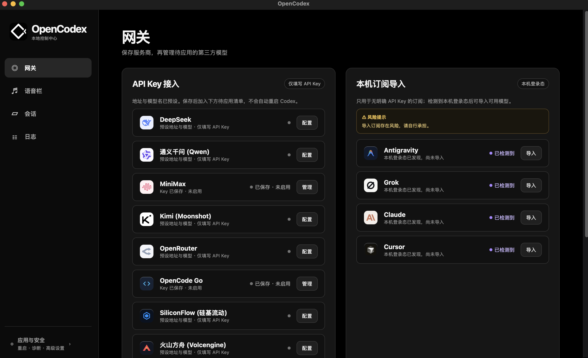
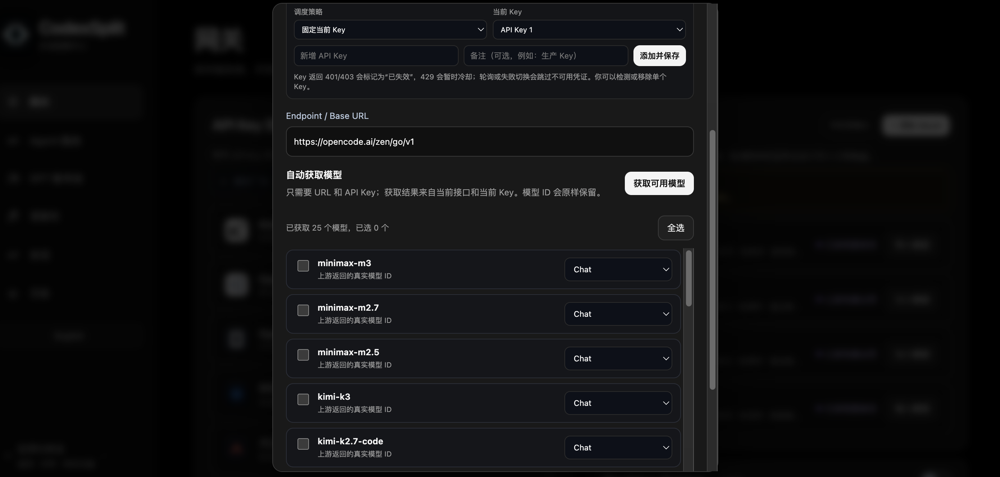
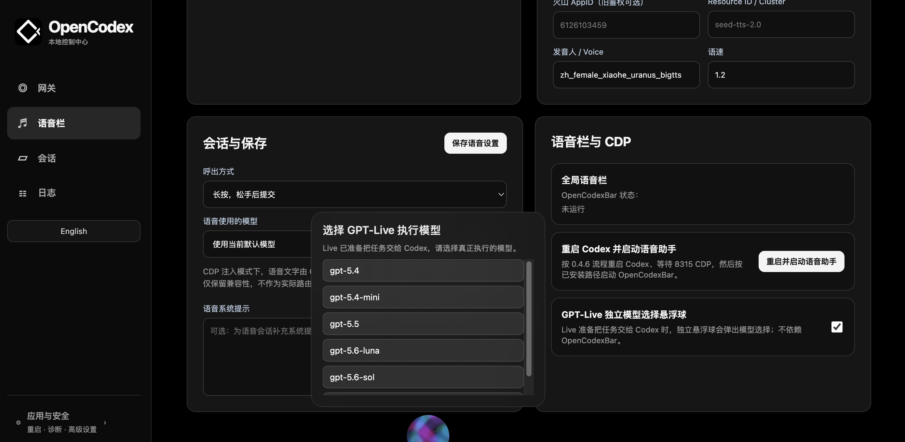
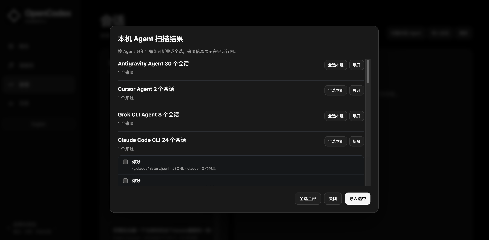
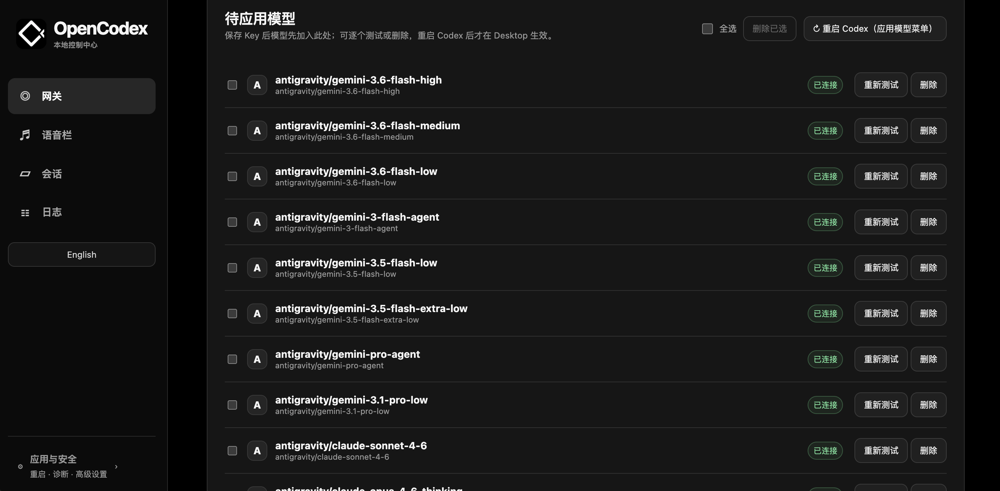
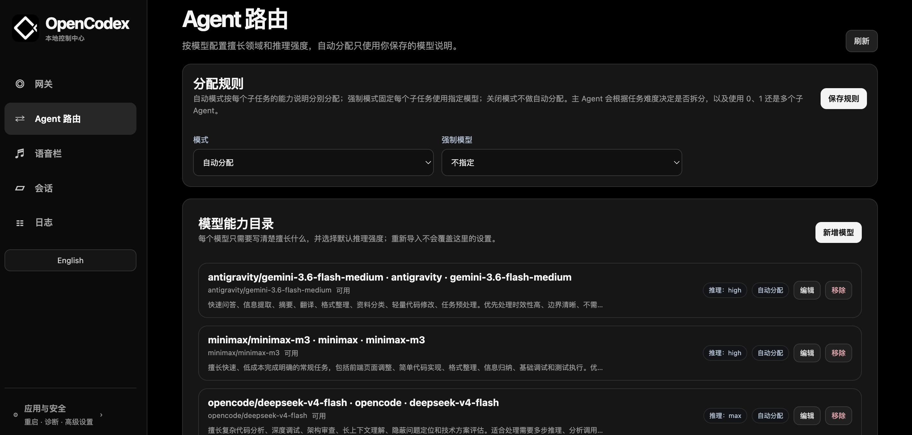

# CodexSplit

### 把 Codex Desktop 变成你的本地 AI 工作台

CodexSplit 是运行在本机的 Codex Desktop 控制中心：把第三方模型、模型目录、语音助手、GPT-Live、会话管理和 Agent 工具集中到一个桌面应用中，同时保留 Codex 原生模型、原生登录、Computer Use 与 MCP 的独立运行方式。

<p align="center">
  <a href="https://github.com/AITabby/codexsplit/releases"></a>
  <a href="https://github.com/AITabby/codexsplit"></a>
  <a href="https://github.com/AITabby/codexsplit/releases/tag/v2.0.0-beta.1"></a>
  <a href="https://github.com/AITabby/codexsplit"></a>
  <a href="https://x.com/youngxxxxu"></a>
</p>

<p align="center">
  <a href="#简体中文">简体中文</a> · <a href="#english">English</a>
</p>

<p align="center">
  <a href="https://github.com/AITabby/codexsplit/releases/download/v2.0.0-beta.1/CodexSplit-2.0.0-beta.1-arm64.dmg">⬇️ 下载 CodexSplit v2.0.0-beta.1（macOS）</a>
  ·
  <a href="https://github.com/AITabby/codexsplit">🪟 Windows 源码（安装包后续提供）</a>
  ·
  <a href="https://github.com/AITabby/codexsplit/releases/tag/v2.0.0-beta.1">查看 Beta Release</a>
  ·
  <a href="https://x.com/youngxxxxu">🐦 @youngxxxxu</a>
</p>

<p align="center">
  
</p>

## 产品截图

### 第三方模型配置与协议选择

<p align="center">
  
</p>

### 语音栏与 GPT-Live 执行模型选择

<p align="center">
  
</p>

### 扫描并导入本机 Agent 会话

<p align="center">
  
</p>

### 按服务商管理待应用模型

<p align="center">
  
</p>

### Agent 路由与模型能力目录

<p align="center">
  
</p>

> 当前 Beta：macOS Apple Silicon `v2.0.0-beta.1`（`spawn_agent` 子会话先进入 8765 网关，再由网关按模型/Profile 分流）；Windows 先提供同一版本源码，安装包后续发布。Linux 版本尚未发布。
>
> `v1.1.2` 在 `v1.1.1` 基础上统一了官方 GPT 与第三方模型的原生 `gpt-image-2` 生图路径，并保留 `gpt-image-1.5` 作为明确兜底；同时 GPT-Live 只在用户主动开启时启动。
>
> `v1.1.5` 增加了原生 Codex app-server provider bridge：官方 GPT 由 Codex 原生 OpenAI provider 直连，第三方模型继续通过 `127.0.0.1:8765` 网关；切换 provider 时复用同一个 thread 和 rollout，不改写原生 turn 请求。现在 bridge 只在用户已启用第三方模型并明确执行“重启 Codex”时，以进程级环境启动 Desktop；打开 CodexSplit、登录启动项或普通网关重启都不会接管 Desktop。恢复原生会停止 bridge 并以官方路径重新启动 Desktop。
>
> `v1.2.0` 增加了 `spawn_agent` 子会话的网关分流边界：网关拥有的 dispatcher 和 native 子会话的外层 bridge 都把子任务送入 `127.0.0.1:8765/v1/responses`，由网关统一执行模型/Profile 路由；native app-server、主会话和原生 provider 路径保持不变。当前已知限制：部分 Desktop 工作树卡片的推理档位显示可能仍为默认“轻度”，不影响网关实际按 Profile 选择的执行档位。
>
> ✅ macOS Release DMG 已内置独立 Node.js 运行时。下载安装后即可运行网关，不需要额外安装 Node.js、npm 或 Homebrew。
>
> ⚠️ 当前 macOS DMG 未经过 Apple Developer 签名与公证。首次打开时，如果 macOS 阻止运行，请在“系统设置 → 隐私与安全性”中允许打开。

## 简体中文

### CodexSplit 是什么？

CodexSplit 不替换 Codex Desktop，也不会把官方模型强行改走第三方接口。它在 Codex 旁边提供一个本地网关和控制中心：

- 官方 Codex 模型继续走 Codex 原生路径。
- 只有用户明确添加或导入的第三方模型才进入 CodexSplit 网关。
- 每个服务商和模型都有独立身份，避免同名模型互相覆盖。
- 网关只监听本机回环地址，并为管理接口提供本地授权保护。

### 功能总览

| 模块 | 功能 |
| --- | --- |
| 🌐 本地网关 | 管理服务商、API Key、模型、协议和本机订阅，并把已启用模型接入 Codex Desktop |
| 🧠 动态模型目录 | 自动读取模型推理档位、上下文窗口、协议和其他能力元数据 |
| 🔌 多协议路由 | 支持 OpenAI Responses、OpenAI Chat Completions，以及 Anthropic、Google、DeepSeek、MiniMax 等适配路径 |
| 🎙️ 语音助手 | STT、TTS、VAD、语音系统提示、全局语音栏和可视化 HUD |
| 🤖 GPT-Live | 进行实时语音沟通，并可随时把任务安排给任意已接入模型执行；支持随时切换执行模型 |
| 🖥️ Computer Use | 让第三方模型使用 Codex 原生桌面操作执行器，支持截图结果和工具续接 |
| 💬 会话中心 | 浏览本地 Codex 会话、查看可见上下文、删除会话、扫描并导入外部 Agent 会话 |
| 🧰 Agent / MCP | 保留 Codex 原生 MCP 与工具能力，并兼容第三方模型的工具调用和连续执行 |
| 🧭 Agent 路由 | 按模型能力说明和默认推理强度自动分配子任务，也支持强制指定模型或关闭路由 |
| 🛡️ 原生保护 | 一键重启应用模型，或一键恢复原生 Codex，不破坏官方模型路径 |
| 📋 日志与诊断 | 查看网关实时日志、服务商连接状态、模型测试状态和启动状态 |

## 详细功能

### 1. 服务商与第三方模型管理

CodexSplit 控制中心提供常用服务商预设，也允许手动添加 OpenAI Compatible 服务：

- 常用预设：DeepSeek、Qwen、Z.ai、MiniMax、Kimi。
- 更多预设：OpenRouter、OpenCode Go、SiliconFlow、火山方舟。
- 自定义 OpenAI Compatible：填写 Endpoint / Base URL、API Key 和模型名称。
- 一个服务商可以配置多个模型，支持逐个测试、删除和重新测试。
- 每个模型可以单独选择 `Chat` 或 `Responses` 协议。
- 支持模型显示名与实际后端模型名分离，例如 `我的模型=backend-model-id`。

#### 服务商预设来源说明

控制中心里几十个 API 服务商预设的名称、公开 Endpoint 元数据、协议提示和模型 ID，参考了 [CC Switch 的 Codex provider preset 列表](https://github.com/farion1231/cc-switch/blob/main/src/config/codexProviderPresets.ts)。这是公开目录元数据的引用与整理，不是对 CC Switch 的认证、代理、订阅、推广或图标实现的复制。预设列表不代表服务商官方合作或接口必然可用；实际模型、权限、计费和兼容性必须以用户自己的 Endpoint、API Key 和测试结果为准。
- 服务商命名空间会自动生成，例如 `deepseek/model-name`、`opencode/model-name`，避免不同服务商的同名模型冲突。
- 模型先进入“待应用模型”列表；测试通过后，重启 Codex 才会写入 Desktop 的模型菜单。
- 支持批量选择和删除已添加模型。

### 2. 模型推理档位自动识别

模型的推理档位不是按某个厂商硬编码，而是按模型实际能力生成：

- 如果厂商接口返回了推理档位，就使用该模型自己的档位列表。
- 如果模型注册表返回了明确档位，也会按注册表显示。
- 已返回的窄档位不会被强行补成其他档位；模型只有两档或四档时，就显示两档或四档。
- 如果模型没有返回可枚举的推理档位，只保留“自动”，不会猜测或发送固定档位。
- 如果服务商明确声明模型不支持推理，则不显示推理档位。
- 模型的默认档位会从该模型实际支持的列表中选择，不会发送不存在的档位。

### 3. 上下文窗口自动识别

上下文长度按模型单独保存和使用：

1. 优先使用厂商 `/models` 或其他实时接口明确返回的上下文窗口。
2. 没有实时返回时，使用模型注册表提供的上下文窗口。
3. 两者都没有时，使用 `200K` 作为保守兜底值。
4. 已经由厂商接口确认过的窗口不会被不明确的注册表数据覆盖。
5. 原生 Codex 模型继续使用 Codex 自己的上下文限制，不由第三方目录覆盖。

因此，不同第三方模型可以拥有不同的上下文长度；切换模型时，目录元数据也会跟着模型切换。

### 4. 本机订阅导入

在 macOS 上，CodexSplit 可以检测和导入部分本机桌面/CLI 登录态，并实时获取服务商可用模型：

- **Antigravity**：读取本机 OAuth 登录态，并动态获取模型目录。
- **Grok**：读取 Grok CLI 登录态、刷新令牌并获取模型目录。
- **Claude**：读取 Claude Desktop 新版加密 OAuth 缓存，同时兼容旧缓存、Claude Code 登录态和 OAuth 刷新/交换。
- **Cursor**：读取本机 Cursor 登录态、刷新令牌，并通过 Cursor AgentService 获取模型。

订阅导入不会只凭“检测到登录文件”就自动添加模型，而是需要用户点击导入，并以服务商实时返回的模型为准。导入后仍可以测试、删除或重新导入。

### 5. 网关路由与协议兼容

CodexSplit 网关会根据模型目录中的服务商、后端模型名和协议进行明确路由：

- 原生 Codex Responses 请求继续转发到官方 Codex 后端。
- 第三方模型可以使用 OpenAI Responses 或 Chat Completions。
- Anthropic Messages、Google Gemini、DeepSeek、MiniMax 等有对应的请求/响应适配器。
- 支持流式输出、推理内容、工具调用、工具结果和多轮续接。
- 第三方 Responses 不支持某项能力时，可以按协议安全回退到 Chat 路径。
- 支持请求体解压、流式背压、上游瞬时网络错误重试和响应头安全转发。
- 原生 GPT 的上下文压缩完全透传；第三方 Responses 模型仅在原生支持 `/responses/compact` 时转发并转换后端模型名，不生成网关自定义压缩结果。

#### v1.1.5 provider 分流与原生会话

- 官方 GPT、o-series 和 Codex 模型由原生 Codex app-server 使用 OpenAI provider 直连，不经过第三方适配器。
- 第三方模型仍使用 CodexSplit 网关的 `8765` 端口，继续沿用各服务商自己的协议、上下文、工具和压缩能力。
- Codex Desktop 的 `turn/start` 不携带 provider，bridge 会在 provider 边界卸载并重新加载同一个 thread，然后原样转发 turn；会话 ID、rollout 路径和登录态仍由原生 Codex 管理。
- 从 CodexSplit 的“重启 Codex”入口启动 Desktop 才会注入 bridge。bridge 是进程级切换，不再通过 launchd 全局 `CODEX_CLI_PATH` 接管其他 Desktop 启动；手动启动的旧进程保持原生路径。需要第三方模型时，必须明确重启进入 bridge 模式；需要原生 Computer Use / Appshot 时，使用“恢复原生 Codex”重新启动官方路径。

### 6. Computer Use、图像和 MCP

第三方模型的 Computer Use 不会伪造一套独立的桌面执行器，而是接入 Codex 的实际工具执行链：

- 第三方模型可以请求桌面操作，再由 Codex 原生执行器执行。
- 支持屏幕截图、鼠标、键盘和工具结果的连续交互。
- 针对不同供应商对图片大小、格式和工具结果的限制，网关会做兼容处理。
- CodexSplit 不会安装、禁用或改写官方 Codex Computer Use 和 MCP；恢复原生时只会清理可识别的旧版 CodexSplit 遗留禁用条目，并通过状态接口报告 Desktop / Computer Use 的恢复状态。Desktop 的 bridge/native 是进程级切换，恢复原生后会重新启动官方路径。
- 支持原生图像生成桥接，图像请求和普通聊天模型路由保持分离。
- Cursor AgentService 支持工具调用、外部工具结果和连续会话续接。

### 7. GPT-Live 与实时通信

GPT-Live 用于实时语音沟通和任务安排：

- 进行 Live 对话时，可以随时把当前任务安排给任意已接入且可用的模型执行。
- 执行模型可以是官方模型，也可以是已经启用并测试通过的第三方模型；不需要固定使用 Live 当前的对话模型。
- 独立的 GPT-Live 模型选择悬浮球不依赖 CodexSplit Voice Bar。
- 支持在一次任务的连续续接过程中保持正确的模型绑定。
- 原生 Realtime / WebRTC 通信保留独立路径，第三方网关路由不会覆盖原生 Live。

### 8. Agent 路由与模型能力目录

Agent 路由让主 Agent 根据每个模型的实际工作说明分配子任务：

- 在“模型能力目录”中，为已接入模型填写擅长领域 / 工作说明，选择该模型支持的默认推理强度，并决定是否参与自动分配。
- 自动分配只使用用户保存的模型说明，不根据模型名称猜测能力；主 Agent 会根据任务难度决定是否拆分，以及使用 0、1 还是多个子 Agent。
- 支持“自动分配”“强制选择”和“关闭路由”三种模式；强制模式下，每个子任务使用指定模型。
- 能力说明和路由规则独立于模型导入目录，重新导入模型不会覆盖已保存的配置。

### 9. 语音助手与 CodexSplit Voice Bar

语音页包含完整的输入、输出和会话设置：

#### 语音识别 STT

- 本地 Whisper：填写 `base`、`small`、`turbo` 或本地模型文件路径，不需要 API Key。
- OpenAI Compatible / Groq API：填写 API Key、Base URL 和转写模型。

#### 语音合成 TTS

- Edge TTS。
- 火山引擎 / 豆包 TTS，可配置 AppID、Resource ID / Cluster、模型和发音人。
- MiniMax TTS。
- 小米 MiMo TTS。
- OpenAI Compatible TTS API。

#### 会话和体验

- 短按切换持续监听，或使用长按说话、松手提交。
- 配置语音使用的模型和语音系统提示。
- 配置 VAD 静音阈值、结束等待时间和 HUD 动效主题。
- 通过 CodexSplit Voice Bar 提供全局语音栏、麦克风录音、状态胶囊和语音播放。
- 支持重启 Codex、等待 CDP 就绪并启动语音助手。
- 提供 `/visualizer` 动效实验室，可预览和切换语音 HUD 主题。

### 10. 会话中心与 Agent 导入

会话中心可以浏览 Codex 本地会话，并查看完整的可见对话内容：

- 会话列表、标题、模型、工作目录、时间和消息数量。
- 查看用户消息、助手消息和会话中的可见图片。
- 不展示隐藏推理内容，避免把内部记录当作普通对话显示。
- 删除本地会话。
- 支持直接导入 JSON、JSONL、SQLite、SQLite3、DB、Markdown 和 Markdown 文件。

“扫描本机 Agent”可以发现并选择导入：

- Antigravity Agent
- Cursor Agent
- Grok CLI Agent
- Claude Code CLI
- Hermes Agent

导入后会把会话转换为 Codex 可识别的 rollout，并注册到 Codex 会话数据库，使它出现在 Desktop 侧边栏中。

### 11. 应用、安全与还原

- 网关默认只监听 `127.0.0.1`，不直接暴露到局域网。
- 管理接口使用本地 admin cookie / bearer 授权。
- 控制中心不会把 API Key 明文返回到前端；已保存的 Key 使用掩码显示。
- macOS 上的服务商 Key 使用 Keychain 保存，配置文件只保存引用和非敏感元数据。
- 网关日志会记录连接、导入、测试和重启状态，但不应包含完整令牌。
- “重启 Codex”会把待应用模型写入 Desktop 模型目录并重启相关进程。
- “恢复原生 Codex”会移除第三方模型选择、模型目录和托管配置，保留服务商身份、Endpoint 和 Key；同时停止 bridge、清理旧版 CodexSplit 遗留的禁用 Computer Use 条目、重新启动官方 Desktop，并返回 Desktop / Computer Use 的恢复检查结果，不会改动官方 MCP 配置。
- 网关包含单实例锁和父进程退出清理，避免重复启动多个网关进程。

## 使用方式

### macOS 普通用户

1. 先安装并登录 Codex Desktop。
2. 下载 [CodexSplit-2.0.0-beta.1-arm64.dmg](https://github.com/AITabby/codexsplit/releases/download/v2.0.0-beta.1/CodexSplit-2.0.0-beta.1-arm64.dmg)。
3. 打开 DMG，把 `CodexSplit.app` 拖入 `Applications`。
4. 启动 CodexSplit，进入“网关”配置 API Key 或导入本机订阅。
5. 保存模型后，在“待应用模型”中测试连接。
6. 测试通过后点击“重启 Codex（应用模型菜单）”，让模型出现在 Codex Desktop。

DMG 已包含网关所需的独立 Node.js 和语音运行时。普通用户不需要额外安装 Node.js、npm、Homebrew 或 .NET SDK。

### Windows 10/11

当前 Windows 先使用与 macOS Beta 相同的 `v2.0.0-beta.1` 源码：

1. 安装 Codex Desktop。
2. 在仓库中切换到 `v2.0.0-beta.1`，按源码说明构建 Windows 版本。
3. Windows 安装包将在 Windows 端功能接入后单独发布。

Windows 版本以对应安装包实际提供的功能为准；当前 macOS 原生订阅导入、CodexSplit Voice Bar 和部分 CDP 集成依赖 macOS 桌面环境。

### 从源码运行网关

需要 Node.js 和 npm：

```bash
git clone https://github.com/AITabby/codexsplit.git
cd codexsplit
npm install
npm run build
npm start
```

启动后访问：

```text
http://127.0.0.1:8765/dashboard
```

如果要构建 macOS 桌面应用和内置语音伴侣，需要 macOS、Swift 工具链以及项目脚本要求的语音运行时：

```bash
npm run build:all
./macos-app/scripts/package-dmg.sh
```

DMG 产物位于：

```text
macos-app/build/CodexSplit-<version>-arm64.dmg
```

### 测试

```bash
npm test
```

测试覆盖模型目录、推理档位、上下文窗口、服务商命名空间、Responses / Chat 转换、Computer Use、MCP、会话导入、语音控制、Realtime 代理、凭据保护、发布包契约和 macOS 打包契约等功能。

## 工作方式

```text
Codex Desktop
  ├─ 官方模型 / 原生 Responses
  ├─ 原生 Computer Use / MCP
  └─ 原生 Live / Realtime
          │
          ▼
CodexSplit App
  ├─ 本地网关与管理 API
  ├─ 第三方模型目录与协议路由
  ├─ 动态推理档位与上下文元数据
  ├─ GPT-Live 模型交接
  ├─ 语音 STT / TTS / CodexSplit Voice Bar
  ├─ 会话浏览、扫描与导入
  └─ 日志、重启、还原与安全控制
          │
          ▼
API Key 服务商 / 本机订阅 / OpenAI Compatible 服务
```

## 项目状态

CodexSplit 正在持续迭代。当前状态：

- macOS Apple Silicon：`v2.0.0-beta.1` DMG 与完整源码，包含 spawn_agent 网关分流。
- Windows 10/11：同一 Beta 源码已提供，安装包待 Windows 端接入后发布。
- Linux：暂未发布桌面安装包。

建议通过 [GitHub Releases](https://github.com/AITabby/codexsplit/releases) 获取最新版本，并在提交问题时附上系统版本、CodexSplit 版本、服务商、模型名称和脱敏后的网关日志。

## 相关链接

- [GitHub Repository](https://github.com/AITabby/codexsplit)
- [GitHub Issues](https://github.com/AITabby/codexsplit/issues)
- [Latest Release](https://github.com/AITabby/codexsplit/releases/latest)
- [Download CodexSplit v2.0.0-beta.1 DMG for macOS](https://github.com/AITabby/codexsplit/releases/download/v2.0.0-beta.1/CodexSplit-2.0.0-beta.1-arm64.dmg)
- [CodexSplit v2.0.0-beta.1 source for Windows development](https://github.com/AITabby/codexsplit/tree/v2.0.0-beta.1)
- [语音助手使用指南](./VOICE_GUIDE.md)
- [测试流程](./TEST_FLOW.md)
- [X / Twitter: @youngxxxxu](https://x.com/youngxxxxu)

---

## English

### A local AI workspace for Codex Desktop

CodexSplit is a local control center for Codex Desktop. It brings third-party models, provider management, dynamic model metadata, voice, GPT-Live, session import, Agent routing, Computer Use compatibility, and Agent tools into one desktop workflow while keeping native Codex routing separate.

Native Codex models, native login, native Computer Use, MCP, and native Live / Realtime remain on their original paths by default. Only models explicitly added or imported by the user are routed through the CodexSplit gateway. The Desktop bridge is a process-level switch activated only by an explicit restart after third-party models are enabled; it is not exported through launchd and does not silently replace unrelated native launches. The v2.0.0-beta.1 source build sends gateway-owned `spawn_agent` child turns to `127.0.0.1:8765`, where the selected model/Profile is routed.

### Screenshots


### Current releases

- macOS Apple Silicon: `v2.0.0-beta.1` DMG and complete source release with spawn_agent gateway routing.
- Windows 10/11: `v2.0.0-beta.1` source release; installer follows in a later Beta.
- Linux: no desktop package is published yet.

The macOS DMG includes a standalone Node.js runtime and the bundled voice runtime. End users do not need Node.js, npm, Homebrew, or the .NET SDK. The current DMG is not notarized; macOS may require allowing the first launch from **System Settings → Privacy & Security**.

### Feature overview

#### Gateway and provider management

- Presets for DeepSeek, Qwen, Z.ai, MiniMax, Kimi, OpenRouter, OpenCode Go, SiliconFlow, and Volcengine.
- Custom OpenAI-compatible endpoints.
- The dozens of API provider presets reference public provider metadata from [CC Switch's Codex provider preset list](https://github.com/farion1231/cc-switch/blob/main/src/config/codexProviderPresets.ts). CodexSplit does not copy CC Switch authentication, proxy, subscription, promotion, or icon implementations; presets are not an official partnership or an availability guarantee.
- Multiple models per provider, per-model connection tests, deletion, and bulk deletion.
- Per-model Chat or Responses protocol selection.
- Display aliases separated from backend model IDs.
- Stable provider namespaces such as `deepseek/model-name` and `opencode/model-name`.
- Staged model changes that become visible in Codex Desktop after an explicit restart.

#### Dynamic model capabilities

- Reasoning levels come from provider metadata or the model registry when available.
- A model-specific list is authoritative: narrow or extended lists are preserved as returned.
- Models without returned selectable levels expose automatic reasoning only; no fixed levels are guessed.
- Explicitly non-reasoning models expose no reasoning picker.
- Context windows prefer live provider metadata, then the matching model-registry value, and fall back to `200K` only when neither source is available.
- Native Codex model metadata remains independent from third-party catalog metadata.

#### Local subscription imports

On macOS, the dashboard can detect and import available local login states for Antigravity, Grok, Claude, and Cursor. Imports use live provider model discovery instead of blindly relying on a hardcoded model list. Claude Desktop encrypted OAuth cache, legacy caches, Claude Code credentials, Cursor credentials, and token refresh paths are handled separately.

#### Routing and compatibility

- OpenAI Responses and Chat Completions support.
- Anthropic, Google Gemini, DeepSeek, MiniMax, and OpenAI-compatible adapters.
- Streaming, reasoning, tool calls, tool results, multi-turn continuations, request decompression, bounded streaming writes, and transient upstream retries.
- Native GPT compaction is passed through unchanged; third-party compaction is forwarded only when the provider exposes native `/responses/compact`.
- v1.1.5 provider split: official GPT stays on the native OpenAI app-server provider, while third-party models use `127.0.0.1:8765`. The bridge switches the same native thread before forwarding the original turn, preserving the thread and rollout path. Bridge launch is now explicit and process-scoped: login startup, CodexSplit startup, and ordinary gateway restarts leave Desktop native. If the bridge or gateway is unavailable, unsafe third-party routing is not launched; Restore Native stops the bridge and relaunches the official path.
- Native Codex Responses, native Live / Realtime, Computer Use, and MCP are not rewritten by CodexSplit. Native and bridge Desktop modes are explicit process-level states; the dashboard exposes the app-server, launch-environment, and Computer Use MCP recovery status.

#### Computer Use, images, and MCP

Third-party Computer Use requests are connected to the Codex-native executor rather than a fabricated gateway-only tool. Screenshot and tool-result image compatibility, multi-turn tool continuations, native image-generation bridging, and Cursor AgentService tool continuations are supported. Restore Native removes only a recognizable disabled legacy CodexSplit Computer Use entry, leaves the official bundled launcher untouched, restarts the official Desktop path, and reports the resulting health state; bridge mode itself remains an explicit process-level switch.

#### GPT-Live and voice

- GPT-Live can assign the current task to any connected and available official or third-party model at any time, without requiring the Live conversation model to perform the work.
- The independent Live model picker can switch the execution model during a task and does not depend on CodexSplit Voice Bar.
- STT: local Whisper or OpenAI-compatible / Groq transcription APIs.
- TTS: Edge TTS, Volcengine / Doubao, MiniMax, MiMo, or OpenAI-compatible TTS APIs.
- VAD threshold and silence duration, interaction mode, voice prompt, voice model, and HUD theme settings.
- CodexSplit Voice Bar global voice bar, CDP restart flow, and the `/visualizer` theme lab.

#### Agent routing and model capability directory

- Write a capability or work description for each connected model, choose a supported default reasoning level, and decide whether it participates in automatic assignment.
- Automatic assignment uses the descriptions saved by the user; the main Agent decides whether to split a task and how many sub-agents to use.
- Routing supports automatic assignment, a forced model, or routing disabled. Forced mode sends each subtask to the selected model.
- Routing rules and capability descriptions are independent from the imported model directory and survive model re-imports.

#### Sessions and Agent import

- Browse visible Codex messages, metadata, and session images.
- Delete sessions.
- Scan and import Antigravity, Cursor Agent, Grok CLI, Claude Code CLI, and Hermes Agent sessions.
- Import JSON, JSONL, SQLite, DB, and Markdown session files and register imported rollouts in the Codex Desktop sidebar.

#### Security and recovery

- Loopback-only gateway with protected admin APIs.
- Masked credentials in the dashboard and Keychain-backed provider secrets on macOS.
- Live gateway logs and provider test state.
- Native reset removes managed third-party model selections and catalog data while preserving provider identity, endpoints, and credentials.
- Single-instance gateway locking and parent-process cleanup reduce duplicate gateway processes.

### Installation

#### macOS

1. Install and sign in to Codex Desktop.
2. Download the latest published [CodexSplit v2.0.0-beta.1 DMG for Apple Silicon](https://github.com/AITabby/codexsplit/releases/download/v2.0.0-beta.1/CodexSplit-2.0.0-beta.1-arm64.dmg).
3. Drag `CodexSplit.app` into `Applications`.
4. Configure a provider or import a local subscription, test the model, and restart Codex to apply it.

#### Windows 10/11

The `v2.0.0-beta.1` source is the shared development baseline for Windows. A Windows installer will be attached in a later Beta; macOS-specific local subscription, CodexSplit Voice Bar, and CDP integrations are not assumed to have full Windows parity.

#### From source

```bash
git clone https://github.com/AITabby/codexsplit.git
cd codexsplit
npm install
npm run build
npm start
```

Open `http://127.0.0.1:8765/dashboard` after the gateway starts. For the macOS desktop app and bundled voice companion, use `npm run build:all` and `./macos-app/scripts/package-dmg.sh` on macOS.

### Links

- [GitHub Repository](https://github.com/AITabby/codexsplit)
- [GitHub Issues](https://github.com/AITabby/codexsplit/issues)
- [Latest Release](https://github.com/AITabby/codexsplit/releases/latest)
- [Download CodexSplit v2.0.0-beta.1 for macOS](https://github.com/AITabby/codexsplit/releases/download/v2.0.0-beta.1/CodexSplit-2.0.0-beta.1-arm64.dmg)
- [CodexSplit v2.0.0-beta.1 source for Windows development](https://github.com/AITabby/codexsplit/tree/v2.0.0-beta.1)
- [Voice Assistant Guide](./VOICE_GUIDE.md)
- [Test Flow](./TEST_FLOW.md)
- [X / Twitter: @youngxxxxu](https://x.com/youngxxxxu)
